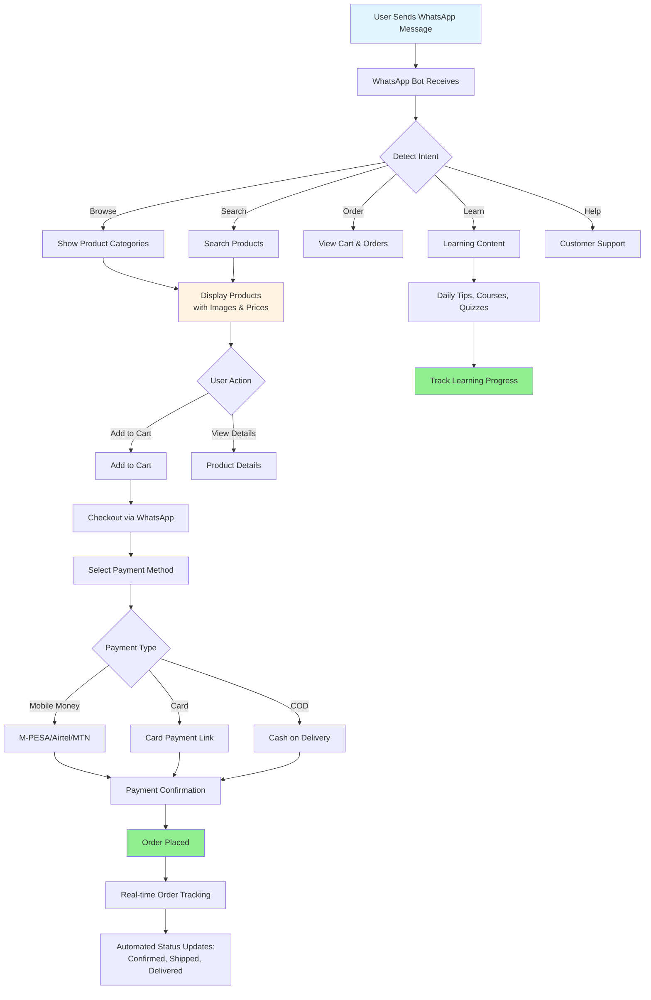

## 1. Jirani Platform - Our Proven Solution

### 1.1 Platform Overview

**Jirani** is our proprietary digital marketplace platform specifically designed for African MSMEs, with a strong focus on women-led businesses. The platform has been developed and refined based on real-world deployment experience, addressing the unique challenges of African markets including low bandwidth, mobile-first usage, and diverse payment methods.

**Platform Highlights:**

| Aspect | Details |
|--------|---------|
| **Current Status** | Production-ready, actively deployed |
| **Target Market** | African WMSMEs across multiple sectors |
| **Architecture** | Multi-tenant, white-label capable, microservices-based |
| **Mobile Optimization** | Progressive Web App (PWA), WhatsApp integration, offline capabilities |
| **Payment Integration** | M-PESA, Airtel Money, MTN Mobile Money, card payments, bank transfers |
| **Key Differentiator** | WhatsApp-first commerce and learning platform |

### 1.2 Core Platform Features

**Marketplace Features:**

| Feature | Description |
|---------|-------------|
| **Product Catalog** | Multi-category product listings with rich media, search, filters |
| **Order Management** | End-to-end order processing, status tracking, notifications |
| **Payment Processing** | Multi-channel payments (mobile money, cards, bank), escrow |
| **Seller Dashboard** | Inventory management, sales analytics, customer management |
| **Buyer Experience** | Product discovery, cart, checkout, order tracking |
| **Reviews & Ratings** | Verified purchase reviews, seller ratings, moderation |
| **WhatsApp Commerce** | Browse, order, pay, track via WhatsApp |

**Business Support Features:**

| Feature | Description |
|---------|-------------|
| **Market Linkage** | AI-powered business matching, supplier/buyer networks |
| **Financial Services** | Credit scoring, loan application, PFI integration |
| **Bookkeeping** | Invoicing, expense tracking, financial reports, OCR receipts |
| **Events Management** | Virtual/physical events, networking, matchmaking |
| **Logistics Integration** | Multi-carrier shipping, tracking, inventory management |
| **Digital Microsites** | Professional storefronts, SEO-optimized, custom domains |

### 1.3 WhatsApp Integration - Our Signature Feature

Jirani's WhatsApp integration is a game-changer for African WMSMEs, providing full platform access through the most popular communication channel in Africa.

**WhatsApp Commerce Flow:**

**WhatsApp Features:**

| Feature | Capabilities |
|---------|-------------|
| **Product Discovery** | Browse categories, search products, view images/prices, product recommendations |
| **Shopping Cart** | Add/remove items, view cart, modify quantities, save for later |
| **Checkout** | Complete purchase flow, address entry, payment selection, order confirmation |
| **Order Tracking** | Real-time status updates, delivery notifications, proof of delivery |
| **Customer Support** | 24/7 chatbot, human agent escalation, order inquiries, complaint resolution |
| **Account Management** | Profile updates, order history, saved addresses, payment methods |
| **Notifications** | Order updates, payment confirmations, promotional offers, learning reminders |
| **Language Support** | English, Swahili (expandable to local languages) |
| **Offline Capability** | Queue messages when offline, sync when connected |

**WhatsApp Technical Implementation:**

| Component | Technology |
|-----------|------------|
| API | WhatsApp Business Cloud API (Meta) |
| Bot Framework | Custom NLP engine with intent recognition |
| Message Queue | Redis for message processing |
| Media Handling | Cloudinary for image optimization |
| Session Management | Redis-based conversation state |
| Analytics | Message engagement, conversion tracking |
| Compliance | Opt-in management, GDPR/data protection |

### 1.5 Technology Stack

| Layer | Technologies |
|-------|-------------|
| **Frontend** | React 18, Next.js 14, TailwindCSS, PWA |
| **Backend** | Node.js, Express, GraphQL, REST APIs |
| **Database** | PostgreSQL 15, Redis 7, Elasticsearch 8 |
| **Storage** | AWS S3, Cloudinary (images/videos) |
| **Messaging** | WhatsApp Business API, Twilio (SMS), SendGrid (Email) |
| **Payments** | Flutterwave, Paystack, M-PESA API |
| **Infrastructure** | AWS (EC2, RDS, S3, CloudFront), Docker, Kubernetes |
| **CI/CD** | GitHub Actions, Docker, Terraform |
| **Monitoring** | Datadog, Sentry, CloudWatch |
| **Security** | SSL/TLS, OAuth 2.0, JWT, AES-256 encryption |

### 1.6 White-Label Capabilities

Jirani is built from the ground up to support multiple Partner Financial Institutions (PFIs) with complete branding customization:

| Customization | Options |
|---------------|---------|
| **Branding** | Custom logo, color scheme, typography, favicon |
| **Domain** | Custom domain (e.g., marketplace.pfiname.com) or subdomain |
| **WhatsApp** | Custom sender names, branded messages |
| **User Interface** | Customizable homepage, navigation, footer |
| **Payment Methods** | PFI-specific payment gateway configurations |
| **Content** | Custom landing pages, help center, FAQs |
| **Features** | Enable/disable features per PFI requirements |
| **Integrations** | PFI-specific API integrations (core banking, CRM) |
| **Reporting** | Custom dashboards and analytics per PFI |

### 1.7 Scalability & Multi-Tenancy

**Multi-Tenancy Architecture:**
- Shared infrastructure with isolated data per PFI
- Row-level security (RLS) for data protection
- Tenant-aware caching and session management
- Independent scaling per tenant
- Automated tenant provisioning (< 1 hour)

### 1.8 Compliance & Security

| Aspect | Implementation |
|--------|----------------|
| **Data Protection** | GDPR compliant, data encryption at rest and in transit |
| **Payment Security** | PCI-DSS Level 1 compliant |
| **Authentication** | Multi-factor authentication (MFA), OAuth 2.0, JWT |
| **Authorization** | Role-based access control (RBAC), granular permissions |
| **Audit Trail** | Immutable logs for all transactions and changes |
| **Backup** | Automated daily backups, 30-day retention, point-in-time recovery |
| **Disaster Recovery** | Multi-region deployment, RTO <4 hours, RPO <1 hour |
| **Penetration Testing** | Quarterly security audits, vulnerability scanning |
| **Compliance** | KYC/AML integration, financial regulations by country |

---