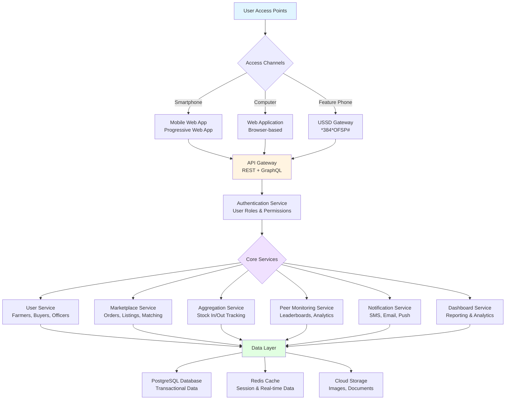
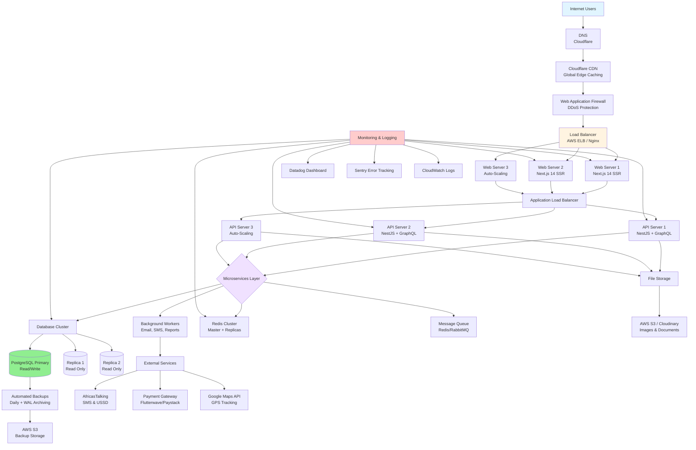
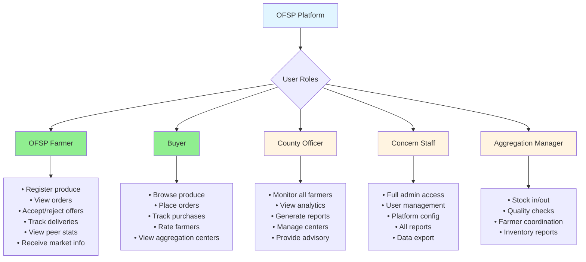

---
puppeteer:
  format: "A4"
  margin:
    top: "2cm"
    right: "1.5cm"
    bottom: "2cm"
    left: "1.5cm"
  printBackground: true
  displayHeaderFooter: true
  headerTemplate: '
Orange-Fleshed Sweet Potato (OFSP) Value Chain Digital Platform
'
  footerTemplate: '
 / 
'
---

# **Technical Proposal: OFSP Digital Marketplace Platform**

**Prepared for:** Concern Worldwide  
**Project:** Orange-Fleshed Sweet Potato (OFSP) Value Chain Digital Platform  
**Location:** Machakos County (Kangundo, Kathiani, Masinga, Yatta Sub-Counties)  
**Reference:** RFP SR104600  
**Date:** November 2025  
**Project Duration:** 25 Days

---

## Executive Summary

We propose to design, develop, and deploy a robust, scalable digital marketplace platform specifically tailored for the Orange-Fleshed Sweet Potato (OFSP) value chain in Machakos County. Leveraging our proven **Jirani platform** with specialized adaptations for agricultural value chains, we will deliver a comprehensive solution that connects OFSP farmers, buyers, County Agricultural Officers, and Concern project staff through an intuitive, multi-channel digital platform.

### Our Solution Delivers:

| Aspect | Details |
|--------|---------|
| **Platform Type** | Agricultural marketplace with real-time aggregation center management |
| **Target Users** | OFSP farmers, buyers, County Agricultural Officers, Concern project staff |
| **Access Channels** | Web application, mobile app (PWA), USSD for feature phones |
| **Core Focus** | Order management, aggregation center tracking, peer monitoring, market information |
| **Timeline** | 25 days from contract signing |
| **Sustainability** | County government ownership with capacity building plan |
| **Compliance** | Kenya Data Protection Act (2019), agricultural data security standards |

### Key Differentiators:

✅ **Proven Platform** - Based on Jirani marketplace, production-tested for African markets  
✅ **Multi-Channel Access** - Web, mobile app, and USSD for universal farmer inclusion  
✅ **OFSP-Specific** - Tailored for sweet potato value chain requirements  
✅ **Real-Time Tracking** - Aggregation center inventory management (stock in/stock out)  
✅ **Peer Monitoring** - Farmer leaderboards and knowledge sharing for competition  
✅ **Mobile-First** - Optimized for low-bandwidth, offline-capable  
✅ **County Handover Ready** - Sustainability plan for long-term local ownership

---

## 1. Understanding the Assignment

### 1.1 Project Context

Machakos County faces critical challenges in the OFSP value chain:
- **Weak market linkages** between farmers and buyers
- **Limited access** to timely market information
- **Poor coordination** among value chain actors
- **Low productivity** (< 10 tons/hectare vs. potential 15-30 tons/hectare)
- **Information asymmetry** affecting farmer income

### 1.2 Our Interpretation

The platform must serve as a **digital coordination hub** that:

| Objective | Our Approach |
|-----------|--------------|
| **Connect Stakeholders** | Direct farmer-buyer interaction, order posting, marketplace functionality |
| **Enable Transparency** | Real-time aggregation center tracking, peer activity monitoring |
| **Provide Visibility** | Dashboards for County Officers and Concern staff for monitoring |
| **Ensure Inclusion** | Multi-channel access (web, app, USSD) for all farmer segments |
| **Build Capacity** | Training, documentation, and handover for sustainability |
| **Scale Impact** | Extendable to other counties and crops beyond project duration |

### 1.3 Expected Outcomes

✅ Increased farmer income through better market access  
✅ Reduced post-harvest losses via efficient aggregation  
✅ Improved coordination across OFSP value chain  
✅ Enhanced transparency in pricing and transactions  
✅ Sustainable, locally-owned digital infrastructure  
✅ Data-driven decision making for County Agricultural Officers  
✅ Knowledge sharing and peer learning among farmers

---

## 2. Jirani Platform - Our Foundation

### 2.1 Platform Overview

**Jirani** is our proprietary digital marketplace platform with proven deployment experience in African agricultural markets. For this OFSP project, we will customize Jirani with OFSP-specific features while maintaining the core architecture that ensures reliability, scalability, and ease of use.

**Platform Highlights:**

| Aspect | Details |
|--------|---------|
| **Current Status** | Production-ready, actively deployed in agricultural markets |
| **Architecture** | Multi-tenant, microservices-based, highly scalable |
| **Mobile Optimization** | Progressive Web App (PWA), offline capabilities, low-bandwidth optimized |
| **Payment Integration** | M-PESA, Airtel Money, bank transfers, cash on delivery |
| **Proven Track Record** | Deployed for similar agricultural value chain projects |

### 2.2 Core Technical Capabilities

| Capability | Implementation |
|-----------|----------------|
| **Real-Time Data** | WebSocket connections for live updates on orders, inventory |
| **Offline Mode** | Service workers enable offline data entry, syncs when connected |
| **Low Bandwidth** | Adaptive content loading, <100KB initial load, image optimization |
| **USSD Integration** | Feature phone access for farmers without smartphones |
| **Multi-Language** | English, Swahili, Kikamba (local language support) |
| **SMS Notifications** | Order confirmations, price alerts, delivery updates |
| **Responsive Design** | Works on any device from feature phones to desktops |
| **Security** | End-to-end encryption, Kenya Data Protection Act (2019) compliant |

---

## 3. Proposed System Architecture

### 3.1 High-Level Architecture

### 3.2 System Components

| Component | Technology | Purpose |
|-----------|------------|---------|
| **Frontend** | React 18 + Next.js 14, TailwindCSS | Web and PWA interface |
| **USSD Gateway** | AfricasTalking USSD API | Feature phone access |
| **Backend API** | NestJS + GraphQL + REST | Business logic and data access |
| **Database** | PostgreSQL 15 | Primary data storage |
| **Cache** | Redis 7 | Session management, real-time data |
| **Storage** | AWS S3 / Cloudinary | Image and document storage |
| **SMS/Notifications** | AfricasTalking SMS API | Farmer notifications |
| **Hosting** | AWS EC2 / DigitalOcean | Cloud infrastructure |
| **CDN** | Cloudflare | Content delivery, DDoS protection |
| **Monitoring** | Datadog / Sentry | Performance monitoring, error tracking |

### 3.3 Production Deployment Architecture

**High-Availability Infrastructure for Scale:**

**Infrastructure Specifications:**

| Component | Specification | Quantity | Purpose |
|-----------|---------------|----------|---------|
| **Web Servers** | 4 vCPU, 8GB RAM, Ubuntu 22.04 | 2-5 (auto-scaling) | Serve frontend application |
| **API Servers** | 4 vCPU, 8GB RAM, Ubuntu 22.04 | 2-5 (auto-scaling) | Handle API requests |
| **Database Primary** | 8 vCPU, 16GB RAM, 500GB SSD | 1 | PostgreSQL master (read/write) |
| **Database Replicas** | 4 vCPU, 8GB RAM, 500GB SSD | 2 | PostgreSQL replicas (read-only) |
| **Redis Cache** | 2 vCPU, 4GB RAM | 3 (1 master + 2 replicas) | Session & caching |
| **Background Workers** | 2 vCPU, 4GB RAM | 2 | Process background jobs |
| **Load Balancer** | AWS ELB / Nginx | 2 (active + standby) | Distribute traffic |
| **Storage** | AWS S3 / Cloudinary | Unlimited | Images, documents, backups |
| **Monitoring** | Datadog/Sentry agents | On all servers | Performance & error tracking |

**Auto-Scaling Configuration:**

| Metric | Threshold | Action |
|--------|-----------|--------|
| **CPU Usage** | >75% for 5 min | Add 1 web/API server |
| **Memory Usage** | >80% for 5 min | Add 1 web/API server |
| **Request Rate** | >1000 req/min | Add 1 API server |
| **Response Time** | >1s (p95) for 5 min | Add 1 API server |
| **CPU Usage** | <30% for 15 min | Remove 1 server (min 2 servers) |
| **Database Connections** | >80% pool | Scale database vertically |

**High Availability Features:**

| Feature | Implementation | Benefit |
|---------|----------------|---------|
| **Load Balancing** | AWS ELB with health checks, automatic failover | Distribute traffic, remove unhealthy servers |
| **Database Replication** | PostgreSQL streaming replication (master + 2 replicas) | Read scaling, automatic failover |
| **Redis Clustering** | Redis Sentinel (1 master + 2 replicas) | Cache availability, automatic failover |
| **Automated Backups** | Daily full backup + continuous WAL archiving | Point-in-time recovery (RPO: 5 min) |
| **Multi-AZ Deployment** | Servers across 2 availability zones | Zone failure protection |
| **CDN Caching** | Cloudflare edge caching (static assets) | Fast global access, reduce server load |
| **Health Checks** | HTTP health endpoints every 30s | Automatic unhealthy server removal |
| **Blue-Green Deployment** | Parallel environments for zero-downtime updates | Safe deployments |

**Disaster Recovery Plan:**

| Scenario | RTO (Recovery Time) | RPO (Recovery Point) | Procedure |
|----------|---------------------|----------------------|-----------|
| **Server Failure** | <5 minutes | 0 (no data loss) | Auto-scaling adds new server, load balancer reroutes |
| **Database Failure** | <10 minutes | <5 minutes | Automatic promotion of replica to master |
| **Data Center Outage** | <30 minutes | <15 minutes | Failover to secondary availability zone |
| **Complete Regional Failure** | <4 hours | <1 hour | Restore from backups to new region |
| **Data Corruption** | <2 hours | <1 hour | Point-in-time recovery from WAL archives |
| **Security Breach** | <1 hour | 0 | Isolate affected servers, restore from clean backup |

**Backup Strategy:**

| Backup Type | Frequency | Retention | Storage Location |
|-------------|-----------|-----------|------------------|
| **Full Database Backup** | Daily at 2 AM | 30 days | AWS S3 (encrypted) |
| **Incremental (WAL)** | Continuous (every 5 min) | 7 days | AWS S3 |
| **Application Files** | Daily | 7 days | AWS S3 |
| **Configuration Backups** | After every change | 90 days | Git repository + S3 |
| **User-Uploaded Files** | Real-time (S3 versioning) | Indefinite | AWS S3 with versioning |

**Security Infrastructure:**

| Layer | Implementation | Purpose |
|-------|----------------|---------|
| **DDoS Protection** | Cloudflare | Mitigate distributed attacks |
| **Web Application Firewall** | Cloudflare WAF | Block SQL injection, XSS, etc. |
| **SSL/TLS** | Let's Encrypt SSL certificates | Encrypt all data in transit |
| **Network Isolation** | VPC with private subnets | Database not publicly accessible |
| **Firewall Rules** | Security groups (whitelist only) | Restrict access to known IPs |
| **Intrusion Detection** | AWS GuardDuty / OSSEC | Detect suspicious activity |
| **Secret Management** | AWS Secrets Manager / HashiCorp Vault | Secure API keys, passwords |
| **Database Encryption** | PostgreSQL encryption at rest | Protect data on disk |
| **Access Logging** | CloudWatch Logs | Audit trail of all access |
| **2FA for Admin** | TOTP-based 2FA | Protect admin accounts |

**Monitoring & Alerting:**

| Metric | Tool | Alert Threshold | Action |
|--------|------|-----------------|--------|
| **Server Uptime** | Datadog | <99.5% | Page on-call engineer |
| **API Response Time** | Datadog | >1s (p95) | Auto-scale, investigate |
| **Error Rate** | Sentry | >1% | Alert dev team |
| **Database CPU** | CloudWatch | >80% | Scale database |
| **Disk Space** | Datadog | >85% | Add storage, clean logs |
| **Failed Payments** | Custom alerts | >5% | Alert payment team |
| **SMS Delivery** | AfricasTalking webhook | <95% | Switch to backup provider |
| **Backup Success** | Cron monitoring | Failed backup | Immediate alert |
| **Security Breach** | GuardDuty | Any detection | Emergency response |

**Cost Optimization:**

| Strategy | Savings | Implementation |
|----------|---------|----------------|
| **Auto-Scaling** | 30-50% | Scale down during off-peak hours (8PM - 6AM) |
| **Reserved Instances** | 40% | Commit to 1-year reserved instances for base load |
| **CDN Caching** | 60% bandwidth | Cache static assets at edge locations |
| **Database Query Optimization** | 25% CPU | Index optimization, query tuning |
| **Image Optimization** | 70% storage | WebP format, compression, lazy loading |
| **Log Retention** | 50% storage | Keep only 30 days of logs |
| **Spot Instances (Workers)** | 70% | Use spot instances for non-critical background jobs |

**Estimated Monthly Infrastructure Cost:**

| Item | Cost (USD) | Cost (KES) |
|------|------------|------------|
| **Web Servers (2-5 instances)** | $50-150 | 6,500-19,500 |
| **API Servers (2-5 instances)** | $50-150 | 6,500-19,500 |
| **Database (Primary + 2 Replicas)** | $150-250 | 19,500-32,500 |
| **Redis Cache (3 instances)** | $30-50 | 3,900-6,500 |
| **Load Balancers** | $30 | 3,900 |
| **Storage (S3 / Cloudinary)** | $20-50 | 2,600-6,500 |
| **Data Transfer** | $20-40 | 2,600-5,200 |
| **Monitoring (Datadog/Sentry)** | $30-60 | 3,900-7,800 |
| **CDN (Cloudflare)** | $20-40 | 2,600-5,200 |
| **Backups** | $10-20 | 1,300-2,600 |
| **SMS & USSD** | $50-100 | 6,500-13,000 |
| **Payment Gateway Fees** | Variable | Based on transaction volume |
| **Domain & SSL** | $10 | 1,300 |
| **Contingency (10%)** | $50-100 | 6,500-13,000 |
| **Total Estimated** | **$520-1,060** | **67,600-137,800** |

*Note: Costs scale with usage. Lower in early stages, higher with more users.*

**Capacity Planning:**

| Users | API Requests/Day | Database Size | Bandwidth | Infrastructure Cost (Monthly) |
|-------|------------------|---------------|-----------|-------------------------------|
| **500 farmers** | 50,000 | 10 GB | 100 GB | ~$500-700 (~KES 65,000-91,000) |
| **1,000 farmers** | 100,000 | 25 GB | 200 GB | ~$700-900 (~KES 91,000-117,000) |
| **2,000 farmers** | 200,000 | 50 GB | 400 GB | ~$900-1,200 (~KES 117,000-156,000) |
| **5,000 farmers** | 500,000 | 125 GB | 1 TB | ~$1,500-2,000 (~KES 195,000-260,000) |

---

## 4. User Roles & Permissions

### 4.1 User Groups

| User Role | Access Level | Key Functions |
|-----------|--------------|---------------|
| **OFSP Farmers** | Standard User | Register, post produce, view orders, track sales, view peer activity, receive market info |
| **Buyers** | Standard User | Register, browse produce, place orders, track purchases, rate farmers |
| **County Agricultural Officers** | Extension Officer | View all farmers, monitor activities, generate reports, provide advisory, manage aggregation centers |
| **Concern Project Staff** | Administrator | Full platform access, user management, analytics, reporting, system configuration |
| **Aggregation Center Managers** | Operator | Stock in/out tracking, quality checks, farmer coordination, inventory reports |

### 4.2 Permission Matrix

---
