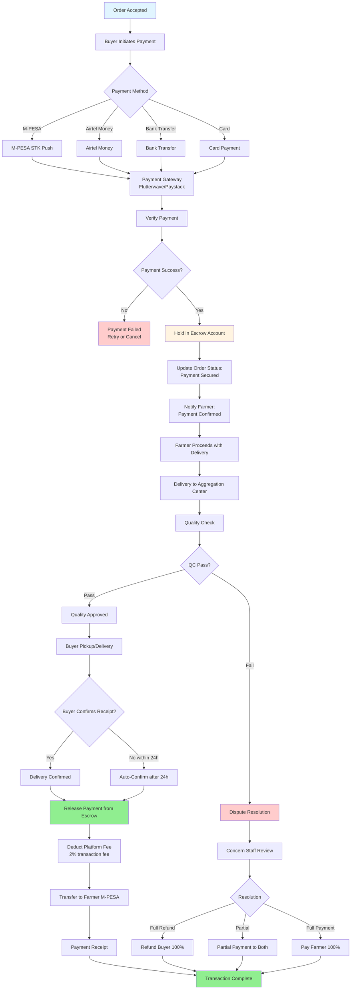
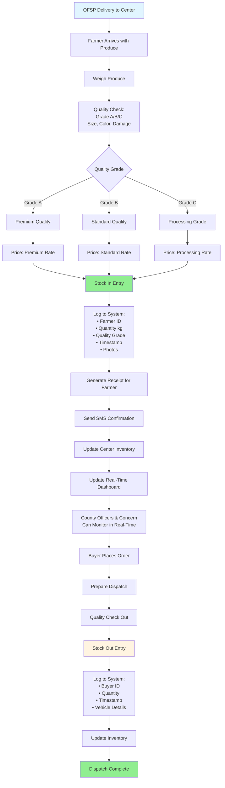
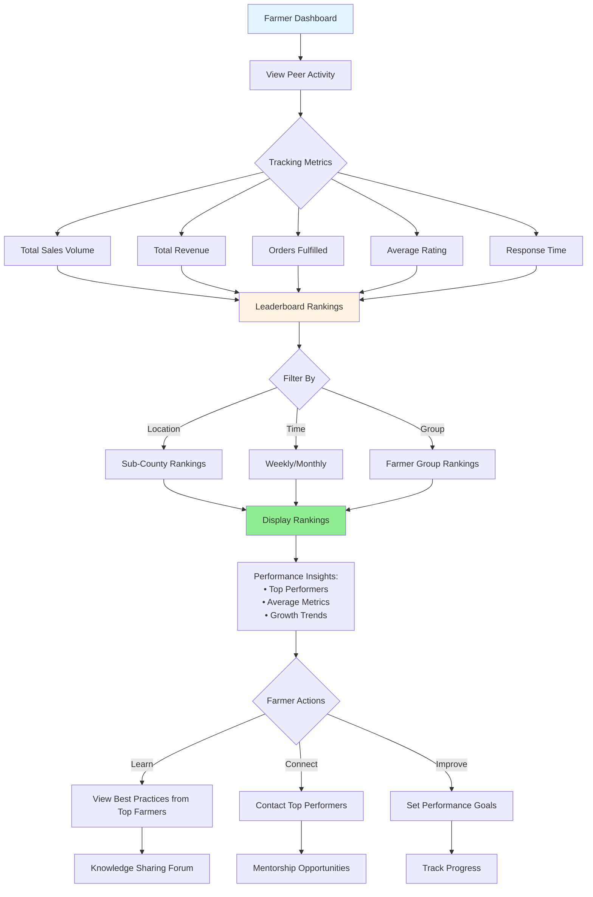
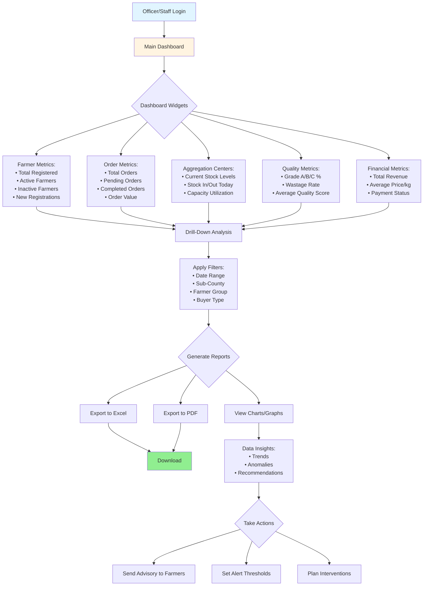
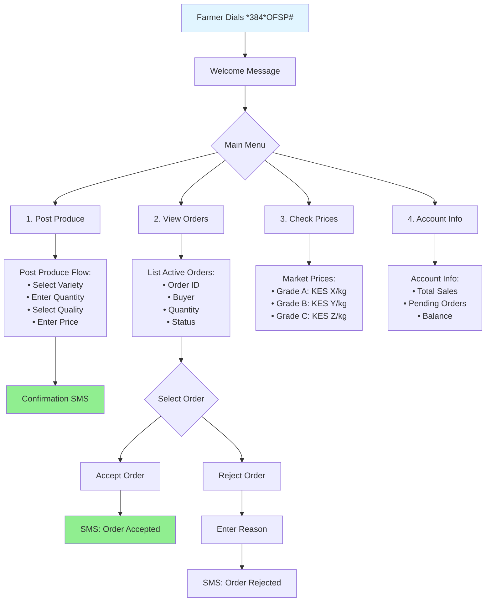

---
puppeteer:
  format: "A4"
  margin:
    top: "2cm"
    right: "1.5cm"
    bottom: "2cm"
    left: "1.5cm"
  printBackground: true
  displayHeaderFooter: true
  headerTemplate: '
Orange-Fleshed Sweet Potato (OFSP) Value Chain Digital Platform Technical Proposal
'
  footerTemplate: '
 / 
'
---

# **Technical Proposal Part 2: Core Platform Features**

## 5. Core Platform Features

### 5.1 Marketplace Module

**Order Management Flow:**

```mermaid
flowchart TD
    Start[Farmer Harvests OFSP] --> Post[Post Available Produce]
    
    Post --> Listing[Create Listing:<br/>Quantity, Quality Grade,<br/>Price, Location]
    
    Listing --> Visible[Listing Visible to Buyers]
    
    Visible --> Browse[Buyers Browse<br/>Available Produce]
    
    Browse --> Order{Buyer Action}
    Order -->|Place Order| OrderCreate[Create Order]
    Order -->|Request Quote| RFQ[Request for Quote]
    
    OrderCreate --> Notify[Notify Farmer via SMS]
    RFQ --> NegotiateFarmer[Farmer Receives RFQ]
    
    Notify --> FarmerReview{Farmer Reviews Order}
    NegotiateFarmer --> FarmerQuote[Farmer Sends Quote]
    
    FarmerQuote --> BuyerAccept{Buyer Accepts?}
    BuyerAccept -->|Yes| OrderCreate
    BuyerAccept -->|No| Browse
    
    FarmerReview -->|Accept| Accepted[Order Accepted]
    FarmerReview -->|Reject| Rejected[Order Rejected]
    FarmerReview -->|Counter| Counter[Counter Offer]
    
    Counter --> BuyerReview{Buyer Reviews}
    BuyerReview -->|Accept| Accepted
    BuyerReview -->|Reject| Rejected
    
    Accepted --> Delivery[Arrange Delivery]
    Delivery --> Aggregation[Deliver to Aggregation Center]
    
    Aggregation --> QC[Quality Check]
    QC --> StockIn[Stock In - Log Entry]
    
    StockIn --> Dispatch[Buyer Dispatch]
    Dispatch --> StockOut[Stock Out - Log Exit]
    
    StockOut --> Payment[Payment Processing]
    Payment --> Complete[Order Complete]
    
    Complete --> Rating[Buyer Rates Farmer]
    Rating --> PeerUpdate[Update Peer Leaderboard]
    
    style Start fill:#e1f5ff
    style Listing fill:#fff4e1
    style Accepted fill:#90EE90
    style Complete fill:#90EE90
    style Rejected fill:#ffcccc
```

**Key Features:**

| Feature | Description |
|---------|-------------|
| **Produce Listing** | Farmers post available OFSP with quantity, quality grade, price, photos, location |
| **Search & Filter** | Buyers search by location, quantity, quality grade, price range, variety |
| **Order Creation** | Buyers place orders directly or request quotes from farmers |
| **Negotiation** | Built-in messaging for price negotiation between farmers and buyers |
| **Order Tracking** | Real-time status updates (pending, accepted, in-transit, delivered, completed) |
| **Smart Matching** | Algorithm suggests farmers to buyers based on location, capacity, rating |
| **Bulk Orders** | Buyers can aggregate orders from multiple farmers |
| **Recurring Orders** | Set up weekly/monthly standing orders for consistent supply |

#### 5.1.1 Live Order Tracking System

**Real-Time Order Journey with 8 Status Stages:**

| Stage | Description | Notifications | Actions |
|-------|-------------|---------------|---------|
| **1. Order Placed** | Buyer creates order | SMS to farmer | Farmer can accept/reject |
| **2. Order Accepted** | Farmer accepts order | SMS to buyer | Payment initiated |
| **3. Payment Secured** | Buyer payment in escrow | SMS to both parties | Farmer prepares delivery |
| **4. In Transit** | Farmer delivering to center | Real-time updates | GPS tracking (optional) |
| **5. At Aggregation Center** | Produce delivered | SMS to buyer & manager | Quality check begins |
| **6. Quality Approved** | QC passed, stock logged | SMS to buyer with photos | Ready for buyer pickup |
| **7. Out for Delivery** | Buyer collecting/dispatching | Location updates | ETA calculation |
| **8. Delivered & Complete** | Buyer confirms receipt | Payment released to farmer | Rating & review |

**Live Tracking Features:**

| Feature | Description |
|---------|-------------|
| **Visual Timeline** | Interactive timeline showing all status changes with timestamps |
| **Real-Time Notifications** | SMS + in-app push notifications at every stage |
| **Photo Documentation** | Upload photos at aggregation center (quality check) and final delivery |
| **GPS Tracking (Optional)** | Track delivery vehicle location in real-time for large orders |
| **ETA Calculation** | Estimated arrival time based on distance and traffic data |
| **Multi-Party Dashboard** | Farmer, buyer, county officers all see live status |
| **Status History** | Complete audit trail with user actions and timestamps |
| **Dispute Flagging** | Mark issues at any stage for Concern staff intervention |

**Tracking Dashboard View:**

```mermaid
flowchart LR
    Order[Order #12345] --> S1[Order Placed<br/>✓ 10:30 AM]
    S1 --> S2[Accepted<br/>✓ 10:45 AM]
    S2 --> S3[Payment Secured<br/>✓ 11:00 AM]
    S3 --> S4[In Transit<br/>⏳ Current]
    S4 --> S5[At Center<br/>⏱ Pending]
    S5 --> S6[Quality Check<br/>⏱ Pending]
    S6 --> S7[Out for Delivery<br/>⏱ Pending]
    S7 --> S8[Delivered<br/>⏱ Pending]
    
    style S1 fill:#90EE90
    style S2 fill:#90EE90
    style S3 fill:#90EE90
    style S4 fill:#fff4e1
    style S5 fill:#f0f0f0
    style S6 fill:#f0f0f0
    style S7 fill:#f0f0f0
    style S8 fill:#f0f0f0
```

#### 5.1.2 Escrow Payment System

**Secure Payment Flow:**

**Escrow System Features:**

| Feature | Description |
|---------|-------------|
| **Payment Hold** | Buyer payment held in secure escrow account until delivery confirmation |
| **Multi-Payment Methods** | M-PESA, Airtel Money, bank transfer, card payments |
| **Automatic Release** | Payment auto-released 24 hours after delivery if no dispute |
| **Dispute Resolution** | Concern staff can review disputes and authorize full/partial payments |
| **Transaction Fees** | 2% platform fee deducted at payment release (sustainable revenue) |
| **Instant Confirmation** | Real-time payment verification and SMS confirmation |
| **Payment History** | Complete transaction log for farmers and buyers |
| **Failed Payment Handling** | Automatic retry mechanism and alternative payment options |
| **Refund Processing** | Automated refund to buyer if order cancelled before delivery |
| **Farmer Protection** | Payment guaranteed once quality check passes |
| **Buyer Protection** | Money back guarantee if produce doesn't meet quality standards |

**Payment Status Tracking:**

| Status | Meaning | Money Location | Next Action |
|--------|---------|----------------|-------------|
| **Pending** | Order created, no payment | N/A | Buyer initiates payment |
| **Processing** | Payment in progress | Payment gateway | Wait for confirmation |
| **In Escrow** | Payment held securely | Escrow account | Farmer delivers produce |
| **Quality Check** | At aggregation center | Escrow account | Quality verification |
| **Ready for Release** | QC passed, awaiting confirmation | Escrow account | Buyer confirms receipt |
| **Released** | Payment sent to farmer | In transit to farmer | Farmer receives M-PESA |
| **Completed** | Farmer received payment | Farmer's account | Transaction closed |
| **Disputed** | Issue flagged | Escrow account (frozen) | Concern staff review |
| **Refunded** | Cancelled/rejected | Returned to buyer | Refund processed |

### 5.2 Aggregation Center Management

**Stock Tracking Flow:**

**Aggregation Center Features:**

| Feature | Description |
|---------|-------------|
| **Stock In Tracking** | Record all incoming produce: farmer, quantity, quality, timestamp, photos |
| **Stock Out Tracking** | Record all outgoing produce: buyer, quantity, dispatch time, vehicle |
| **Quality Grading** | Classify OFSP into Grade A/B/C based on standard parameters |
| **Real-Time Inventory** | Live view of current stock levels by grade and variety |
| **Storage Management** | Track storage duration, alert for aging stock |
| **Wastage Tracking** | Record and analyze post-harvest losses |
| **Photo Documentation** | Capture images at stock in/out for quality verification |
| **Receipt Generation** | Automatic receipt for farmers with QR code for verification |
| **Temperature Logging** | Optional sensor integration for storage conditions |
| **Capacity Management** | Alert when center approaching capacity |

### 5.3 Peer Monitoring & Leaderboards

**Peer Activity Tracker:**

**Peer Monitoring Features:**

| Feature | Description |
|---------|-------------|
| **Leaderboards** | Rankings by sales volume, revenue, order fulfillment, ratings |
| **Performance Metrics** | Individual farmer stats vs. peer averages |
| **Sub-County Rankings** | Competition within local areas (Kangundo, Kathiani, Masinga, Yatta) |
| **Farmer Group Rankings** | Group-level performance comparisons |
| **Best Practices** | Top performers can share tips and techniques |
| **Anonymized Data** | Farmers see peer performance without identifying individuals (optional) |
| **Growth Tracking** | View own improvement over time vs. peers |
| **Achievement Badges** | Earn badges for milestones (100kg sold, 5-star rating, etc.) |

### 5.4 County Officer & Concern Staff Dashboards

**Monitoring Dashboard:**

**Dashboard Features:**

| Feature | Description |
|---------|-------------|
| **Real-Time Metrics** | Live KPIs updated every 5 seconds |
| **Farmer Management** | View all farmers, filter, search, view profiles, deactivate accounts |
| **Order Management** | View all orders, filter by status, intervene in disputes |
| **Aggregation Monitoring** | Real-time view of all centers, stock levels, alerts |
| **Geographic Maps** | Visual map of farmers, buyers, centers in Machakos County |
| **Performance Analytics** | Trends, comparisons, forecasts |
| **Data Export** | Excel, PDF, CSV export for all reports |
| **Alert System** | Automated alerts for anomalies (price spikes, stock-outs, etc.) |
| **User Management** | Create/edit users, assign roles, reset passwords |
| **Audit Logs** | Track all system actions for accountability |

### 5.5 Multi-Channel Access

**Access Channels:**

| Channel | Target Users | Features |
|---------|--------------|----------|
| **Web Application** | County Officers, Concern Staff, Tech-savvy farmers | Full functionality, dashboards, reports, admin tools |
| **Mobile PWA** | Farmers, Buyers | Core marketplace features, offline mode, optimized for 2G/3G |
| **USSD (*384*OFSP#)** | Farmers with feature phones | Post produce, check orders, view prices, receive SMS confirmations |
| **SMS Notifications** | All users | Order confirmations, price alerts, delivery updates, reminders |
| **WhatsApp (Optional)** | All users | Market info broadcast, customer support, order status queries |

**USSD Flow:**

---

## 6. Technical Implementation Details

### 6.1 Database Schema

**Core Entities:**

| Entity | Key Fields | Purpose |
|--------|------------|---------|
| **Users** | id, name, phone, email, role, sub_county, farmer_group, status | User accounts and authentication |
| **Listings** | id, farmer_id, variety, quantity, quality_grade, price, location, photos, status | OFSP produce listings |
| **Orders** | id, listing_id, buyer_id, farmer_id, quantity, price, status, delivery_date | Order transactions |
| **AggregationCenters** | id, name, location, capacity, manager_id, sub_county | Aggregation center details |
| **StockMovements** | id, center_id, type (in/out), farmer_id/buyer_id, quantity, quality_grade, timestamp, photos | Stock tracking |
| **Inventory** | id, center_id, variety, quality_grade, quantity, last_updated | Real-time inventory |
| **Prices** | id, variety, quality_grade, price, date, source | Market price history |
| **Notifications** | id, user_id, type, message, channel (SMS/email/push), status, sent_at | Notification logs |
| **PeerMetrics** | id, farmer_id, sales_volume, revenue, orders_fulfilled, avg_rating, period | Leaderboard data |
| **AuditLogs** | id, user_id, action, entity, timestamp, ip_address | System audit trail |

### 6.2 API Endpoints

**Core API Structure:**

| Endpoint | Method | Purpose | Access |
|----------|--------|---------|--------|
| `/api/auth/register` | POST | User registration | Public |
| `/api/auth/login` | POST | User authentication | Public |
| `/api/listings` | GET | Browse produce listings | All users |
| `/api/listings` | POST | Create produce listing | Farmers |
| `/api/orders` | GET | View orders | Farmers, Buyers |
| `/api/orders` | POST | Create order | Buyers |
| `/api/orders/:id/accept` | PUT | Accept order | Farmers |
| `/api/aggregation/stock-in` | POST | Log stock in | Center Managers |
| `/api/aggregation/stock-out` | POST | Log stock out | Center Managers |
| `/api/aggregation/inventory` | GET | View inventory | Officers, Staff |
| `/api/peers/leaderboard` | GET | View peer rankings | Farmers |
| `/api/dashboard/metrics` | GET | Dashboard KPIs | Officers, Staff |
| `/api/reports/generate` | POST | Generate reports | Officers, Staff |
| `/api/notifications/send` | POST | Send notification | System |
| `/api/ussd/callback` | POST | USSD interactions | USSD Gateway |

### 6.3 Security Implementation

**Security Measures:**

| Component | Implementation |
|-----------|----------------|
| **Authentication** | JWT tokens with 24-hour expiry, refresh tokens for mobile |
| **Authorization** | Role-based access control (RBAC), middleware validation |
| **Data Encryption** | AES-256 encryption at rest, TLS 1.3 in transit |
| **Password Security** | Bcrypt hashing with salt, minimum 8 characters, complexity requirements |
| **API Rate Limiting** | 100 requests/minute per user, 1000/minute per IP |
| **Input Validation** | Server-side validation, SQL injection prevention, XSS protection |
| **Data Privacy** | Kenya Data Protection Act (2019) compliant, GDPR-aligned |
| **Audit Logging** | All critical actions logged with user, timestamp, IP |
| **Backup** | Daily automated backups, 30-day retention, point-in-time recovery |
| **DDoS Protection** | Cloudflare CDN with DDoS mitigation |

### 6.4 Performance Optimization

**Optimization Strategy:**

| Aspect | Implementation | Target Metric |
|--------|----------------|---------------|
| **Page Load Time** | Code splitting, lazy loading, image optimization | <3s on 3G |
| **API Response Time** | Redis caching, database indexing, query optimization | <500ms (p95) |
| **Offline Mode** | Service workers, IndexedDB local storage | Full CRUD offline |
| **Image Optimization** | WebP format, responsive images, lazy loading | <100KB per image |
| **Database** | Indexes on foreign keys, query optimization, connection pooling | <100ms queries |
| **CDN** | Static assets served via Cloudflare CDN | <50ms asset delivery |
| **Caching** | Redis for sessions, API responses (5-min TTL) | 80% cache hit rate |
| **Mobile Data** | Progressive image loading, data compression | <1MB per page |

---
