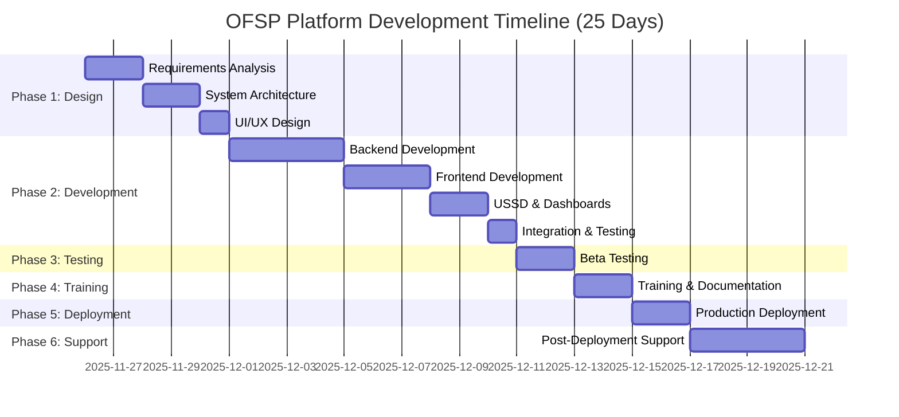
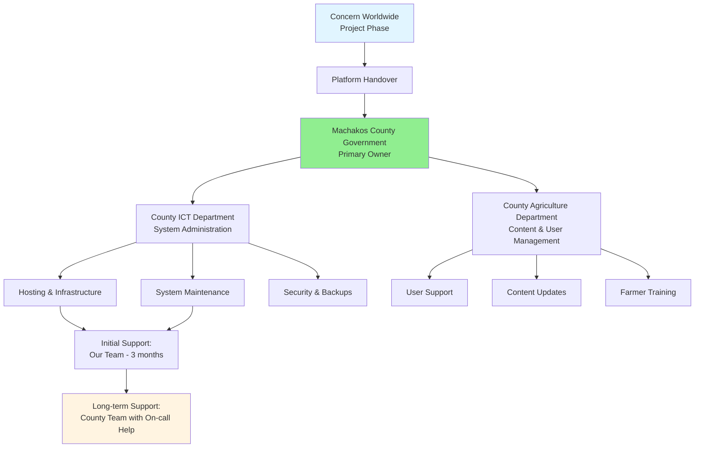

---
puppeteer:
  format: "A4"
  margin:
    top: "2cm"
    right: "1.5cm"
    bottom: "2cm"
    left: "1.5cm"
  printBackground: true
  displayHeaderFooter: true
  headerTemplate: '
Orange-Fleshed Sweet Potato (OFSP) Value Chain Digital Platform Technical Proposal
'
  footerTemplate: '
 / 
'
---

# **Technical Proposal Part 3: Implementation & Delivery**

## 7. Implementation Methodology & Work Plan

### 7.1 Development Approach

We will follow an **Agile methodology** with rapid iterations:

| Phase | Approach | Duration |
|-------|----------|----------|
| **Phase 1: Requirements & Design** | Stakeholder workshops, system design, UI/UX mockups | 5 days |
| **Phase 2: Development** | Sprint-based development, daily standups, continuous testing | 10 days |
| **Phase 3: Testing & Refinement** | Beta testing with Concern staff, bug fixes, user feedback | 2 days |
| **Phase 4: Training & Documentation** | User training, admin training, documentation | 2 days |
| **Phase 5: Deployment & Handover** | Production deployment, final testing, handover | 2 days |
| **Phase 6: Post-Deployment Support** | Bug fixes, monitoring, optimization | 4 days (overlap) |

### 7.2 Detailed Work Plan

**Phase 1: Requirements Analysis & Design (Days 1-5)**

| Day | Activities | Deliverables |
|-----|------------|--------------|
| **Day 1** | • Kickoff meeting with Concern & County Officers • Stakeholder interviews • Review existing systems/processes • Confirm user roles and access levels | Meeting minutes, Stakeholder interview notes |
| **Day 2** | • Define functional requirements • Map user workflows • Define data structures • API endpoint specifications | Functional requirements document (draft) |
| **Day 3** | • System architecture design • Database schema design • Security & compliance review • Technology stack finalization | System architecture document, Database ERD |
| **Day 4** | • UI/UX wireframes • Mobile & web mockups • USSD flow design • Dashboard layout designs | UI/UX mockups, Wireframes |
| **Day 5** | • Review & validation with Concern • Finalize requirements • Project plan confirmation | **Deliverable 1: System Requirement & Design Document** |

**Phase 2: Platform Development (Days 6-15)**

| Day | Activities | Deliverables |
|-----|------------|--------------|
| **Days 6-7** | • Setup development environment • Database creation & migration • Backend API skeleton • Authentication module | Development environment ready |
| **Days 8-9** | • Marketplace module (listings, orders) • Aggregation center module (stock tracking) • User management module | Core backend APIs |
| **Days 10-11** | • Frontend development (web & mobile PWA) • Farmer interface • Buyer interface | Frontend interfaces (70% complete) |
| **Days 12-13** | • USSD gateway integration • SMS notification system • Dashboard for County Officers & Concern Staff • Peer monitoring module | USSD & dashboards functional |
| **Days 14-15** | • Integration testing • Bug fixes • Performance optimization • Security hardening | **Deliverable 2: Prototype Platform for Review** |

**Phase 3: Testing & Validation (Days 16-17)**

| Day | Activities | Deliverables |
|-----|------------|--------------|
| **Day 16** | • Deploy beta version to staging server • Concern staff testing (functionality) • Security testing • Performance testing | Beta version deployed |
| **Day 17** | • Collect feedback • Bug fixes • UI/UX refinements • Final testing | **Deliverable 3: Testing Report with Refinements** |

**Phase 4: Training & Capacity Building (Days 18-19)**

| Day | Activities | Deliverables |
|-----|------------|--------------|
| **Day 18** | • County Officer training (dashboard, user management, reports) • Aggregation center manager training (stock tracking) • Concern staff training (admin functions) | Training sessions completed |
| **Day 19** | • Farmer training (marketplace, USSD, orders) • Buyer training (browsing, ordering, ratings) • Create video tutorials | **Deliverable 4: Training Manuals & Materials** |

**Phase 5: Deployment & Handover (Days 20-21)**

| Day | Activities | Deliverables |
|-----|------------|--------------|
| **Day 20** | • Deploy to production server • DNS configuration • SSL certificate setup • Final smoke testing | Production platform live |
| **Day 21** | • System handover to County ICT officers • Provide admin credentials • Knowledge transfer session • Sustainability plan review | **Deliverable 5: Final Platform & Technical Documentation** |

**Phase 6: Post-Deployment Support (Days 22-25)**

| Day | Activities | Deliverables |
|-----|------------|--------------|
| **Days 22-25** | • Monitor system performance • Address any critical bugs • User support • Performance optimization | Stable production system |

### 7.3 Gantt Chart

---

## 9. Deliverables

### 9.1 Deliverable Schedule

| Deliverable | Description | Due Day | Format |
|-------------|-------------|---------|--------|
| **D1: System Requirement & Design Document** | Complete technical specifications, architecture, UI/UX mockups, database schema | Day 5 | PDF + Editable (Word/Figma) |
| **D2: Prototype Platform** | Functional beta version with core features for testing | Day 15 | Web URL + Mobile App Link |
| **D3: Testing Report** | Comprehensive testing results, bug fixes, refinements | Day 17 | PDF Report |
| **D4: Training Package** | User manuals, admin guides, video tutorials, training materials | Day 19 | PDF + Videos + Presentation |
| **D5: Final Platform** | Production-ready platform hosted on secure server | Day 21 | Live URL + Admin Access |
| **D6: Technical Documentation** | Source code, API docs, deployment guide, database docs, admin credentials | Day 21 | PDF + Code Repository |
| **D7: Sustainability Plan** | Long-term ownership, hosting, maintenance, handover plan | Day 21 | PDF Document |
| **D8: Post-Deployment Report** | Performance metrics, user feedback, recommendations | Day 25 | PDF Report |

### 9.2 Deliverable Details

**D1: System Requirement & Design Document**
- Executive summary
- Functional requirements (detailed)
- System architecture diagrams
- Database ERD and schema
- API endpoint specifications
- UI/UX wireframes and mockups
- User role and permission matrix
- Security and compliance specifications
- Technology stack justification

**D2: Prototype Platform**
- Beta version on staging server
- Core marketplace functionality
- Aggregation center tracking
- Peer monitoring features
- Admin dashboards
- USSD gateway (demo mode)
- Test data and user accounts

**D3: Testing Report**
- Functionality testing results
- Usability testing findings
- Security audit results
- Performance benchmarks
- Browser/device compatibility matrix
- Bug log and resolution status
- User feedback summary
- Refinements implemented

**D4: Training Package**
- **Farmer User Manual** (English, Swahili, Kikamba)
  - Registration process
  - Posting produce
  - Managing orders
  - Using USSD
  - Viewing peer leaderboards
- **Buyer User Manual**
  - Registration and browsing
  - Placing orders
  - Tracking deliveries
  - Rating farmers
- **County Officer Manual**
  - Dashboard navigation
  - Generating reports
  - User management
  - Monitoring aggregation centers
- **Aggregation Center Manager Manual**
  - Stock in/out procedures
  - Quality grading
  - Receipt generation
  - Inventory management
- **System Administrator Guide**
  - User management
  - Platform configuration
  - Troubleshooting
  - Backup and recovery
- **Video Tutorials** (5-10 minutes each)
  - Platform overview
  - Farmer registration and usage
  - Admin dashboard walkthrough
  - Aggregation center operations
- **Training Presentation Slides**

**D5: Final Platform**
- Production deployment on secure hosting
- Custom domain configured (e.g., ofsp.machakos.go.ke)
- SSL certificate installed
- All features functional
- Performance optimized
- Security hardened
- Data migration (if applicable)

**D6: Technical Documentation**
- **Source Code**
  - GitHub/GitLab repository
  - README with setup instructions
  - Code comments and documentation
- **API Documentation**
  - Endpoint descriptions
  - Request/response examples
  - Authentication guide
- **Database Documentation**
  - Schema diagram
  - Table descriptions
  - Relationship documentation
- **Deployment Guide**
  - Server requirements
  - Installation steps
  - Configuration instructions
  - Troubleshooting guide
- **Admin Credentials**
  - Super admin accounts
  - County officer accounts
  - Database access
  - Server access

**D7: Sustainability Plan**
- **Ownership Structure**
  - Machakos County Government ownership
  - Roles and responsibilities
  - Governance framework
- **Hosting Arrangement**
  - Current hosting details
  - Migration to county servers (if applicable)
  - Backup and disaster recovery
- **Maintenance Plan**
  - Regular maintenance schedule
  - Update procedures
  - Security patches
- **Capacity Building**
  - County ICT officer training
  - Knowledge transfer sessions
  - Ongoing support mechanisms
- **Financial Sustainability**
  - Hosting cost estimates
  - Maintenance budget
  - Revenue generation opportunities (optional)
- **Expansion Roadmap**
  - Scaling to other counties
  - Additional features
  - Integration with county systems

**D8: Post-Deployment Report**
- Platform performance metrics (uptime, response time, etc.)
- User adoption statistics
- Feedback from farmers, buyers, officers
- Issues encountered and resolved
- Recommendations for optimization
- Next steps and continuous improvement suggestions

---

## 10. Sustainability Approach

### 10.1 Ownership Model

### 10.2 Sustainability Strategies

| Strategy | Implementation |
|----------|----------------|
| **Local Ownership** | County Government as primary owner with full admin access and source code |
| **Capacity Building** | Comprehensive training for County ICT & Agriculture officers |
| **Knowledge Transfer** | Documentation, video tutorials, hands-on sessions, shadowing |
| **Low Maintenance** | Modern tech stack, automated backups, minimal manual intervention |
| **Cost Efficiency** | Cloud hosting (~$50-100/month), auto-scaling to control costs |
| **Community Engagement** | Farmer champions, buyer ambassadors, extension officer network |
| **Continuous Improvement** | Feedback loops, quarterly reviews, feature prioritization |
| **Integration Ready** | API for integration with county systems (e.g., CIDP, e-Citizen) |
| **Scalability** | Architecture supports expansion to other counties/crops |
| **Revenue Model (Optional)** | Small transaction fees, premium features for large buyers |

### 10.3 Transition Plan

**3-Month Transition Period:**

| Month | Activities | Responsibility |
|-------|------------|----------------|
| **Month 1** | • Platform live with our team actively monitoring • Daily check-ins with County ICT team • Address all critical issues immediately • Collect user feedback | Our Team + County Team |
| **Month 2** | • County ICT team takes primary responsibility • Our team provides on-call support • Weekly review meetings • Resolve non-critical issues | County Team (Lead) + Our Team (Support) |
| **Month 3** | • County team fully independent • Our team available for consultation only • Final performance review • Handover closeout | County Team (Independent) + Our Team (Advisory) |

**Post-Transition:**
- Quarterly check-in calls (Year 1)
- On-call support for critical issues (SLA: 24-hour response)
- Annual platform health check
- Optional paid support contract for enhancements

---

## 11. Risk Management Plan

### 11.1 Identified Risks & Mitigation

| Risk | Probability | Impact | Mitigation Strategy |
|------|-------------|--------|---------------------|
| **Timeline Delay** | Medium | High | Agile sprints, buffer time, parallel workstreams, experienced team |
| **Farmer Adoption** | Medium | High | USSD for feature phones, local language support, extensive training, farmer champions |
| **Internet Connectivity** | High | Medium | Offline mode, SMS fallback, USSD for feature phones, low-bandwidth optimization |
| **Data Security Breach** | Low | High | Encryption, regular audits, access controls, backup systems, compliance with KDPA |
| **Server Downtime** | Low | High | Redundant infrastructure, automated backups, 24/7 monitoring, disaster recovery plan |
| **Budget Overrun** | Low | Medium | Fixed-price contract, clear scope, change management process |
| **Staff Turnover (County)** | Medium | Medium | Comprehensive documentation, video tutorials, multiple trained officers |
| **Scope Creep** | Medium | Medium | Clear requirements, change request process, stakeholder sign-offs |
| **User Data Privacy Concerns** | Low | High | KDPA compliance, clear privacy policy, opt-in consent, data minimization |
| **Integration Challenges** | Medium | Low | Standard APIs, well-documented interfaces, fallback options |

### 11.2 Contingency Plans

| Scenario | Contingency |
|----------|-------------|
| **Developer unavailable** | Backup developer from team, comprehensive code documentation |
| **Hosting server issues** | Backup hosting provider pre-configured, automated failover |
| **USSD gateway failure** | SMS fallback, web/app remain functional, alternative USSD provider |
| **Low farmer adoption** | Incentive program, community mobilization, door-to-door sensitization |
| **Security incident** | Incident response plan, data breach notification protocol, forensics team |
| **Budget constraints** | Phased rollout, prioritize core features, defer nice-to-have features |
| **County handover challenges** | Extended support period, additional training sessions, remote support |

---

