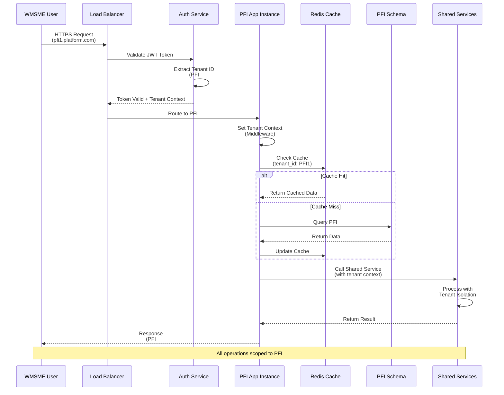

# AGF White-Label Marketplace Platform
## Executive Summary & Technical Overview

**Prepared for:** African Guarantee Fund (AGF)  
**Reference:** AGF/RFP/CD/2025/  
**Submission Date:** October 22, 2025  
**Project Duration:** 9 Months  
**Proposed Budget:** [To be discussed]

---

## 1. Executive Summary

We propose a comprehensive white-label digital marketplace platform that will revolutionize how Partner Financial Institutions (PFIs) support women-led MSMEs across Africa. Our solution is built on proven technologies, designed with mobile-first principles, and optimized for African market conditions.

### 1.1 Solution Overview

Our platform provides:

**For PFIs:**
- Fully customizable white-label marketplace
- Comprehensive admin dashboard
- Analytics and reporting tools
- WMSME management capabilities
- Revenue generation through commissions

**For WMSMEs:**
- Easy-to-use seller dashboard
- Product catalog management
- Order and inventory management
- Access to financial services
- Learning and training resources
- Market linkage opportunities

**For Customers:**
- Intuitive shopping experience
- Multiple payment options
- Order tracking
- Customer support
- Mobile-optimized interface

### 1.2 Key Differentiators

✅ **Mobile-First Design** - Optimized for low-bandwidth African networks  
✅ **Multi-Tenant Architecture** - Scalable support for multiple PFIs  
✅ **Comprehensive Features** - All 25 RFP requirements addressed  
✅ **WhatsApp Integration** - Conversational commerce and microlearning  
✅ **Credit Scoring** - AI-powered creditworthiness assessment  
✅ **Local Payment Methods** - M-PESA, Airtel Money, and more  
✅ **Multilingual** - English, Swahili, French, Portuguese  
✅ **Proven Technology** - Modern, scalable tech stack  

---

## 2. Technical Architecture

### 2.1 Comprehensive System Architecture

```
┌─────────────────────────────────────────────────────────────────────────────────────────────┐
│                                    👥 USER LAYER                                            │
├──────────────────────┬──────────────────────┬──────────────────────┬─────────────────────────┤
│   🛍️ Buyers         │   🏪 Sellers         │   👔 PFI Admins      │   ⚙️ AGF Admins        │
│   (Customers)        │   (WMSMEs)           │   (Moderators)       │   (Platform Owners)     │
└──────────────────────┴──────────────────────┴──────────────────────┴─────────────────────────┘
                                              │
                                              ▼
┌─────────────────────────────────────────────────────────────────────────────────────────────┐
│                              🖥️ PRESENTATION LAYER                                          │
├──────────────────────┬──────────────────────┬──────────────────────┬─────────────────────────┤
│   React PWA          │   Mobile Web         │   WhatsApp Bot       │   Admin Dashboard       │
│   • Offline Support  │   • Touch Optimized  │   • Microlearning    │   • Analytics           │
│   • Push Notify      │   • Low Bandwidth    │   • Order Updates    │   • Management          │
└──────────────────────┴──────────────────────┴──────────────────────┴─────────────────────────┘
                                              │
                                              ▼
┌─────────────────────────────────────────────────────────────────────────────────────────────┐
│                              🔌 API GATEWAY LAYER                                           │
├──────────────────────┬──────────────────────┬──────────────────────┬─────────────────────────┤
│   REST APIs          │   GraphQL            │   WebSocket          │   Authentication        │
│   • CRUD Operations  │   • Flexible Queries │   • Real-time        │   • JWT & OAuth 2.0     │
│   • Versioning       │   • Subscriptions    │   • Live Chat        │   • 2FA/MFA             │
├──────────────────────┴──────────────────────┴──────────────────────┴─────────────────────────┤
│   Rate Limiting      │   Webhooks           │   API Documentation  │   Request Validation    │
│   • DDoS Protection  │   • Event Callbacks  │   • OpenAPI/Swagger  │   • Input Sanitization  │
└──────────────────────┴──────────────────────┴──────────────────────┴─────────────────────────┘
                                              │
                                              ▼
┌─────────────────────────────────────────────────────────────────────────────────────────────┐
│                            ⚡ BUSINESS LOGIC LAYER                                          │
├──────────────────────┬──────────────────────┬──────────────────────┬─────────────────────────┤
│   Tenant Service     │   User Service       │   Product Service    │   Order Service         │
│   • Multi-tenancy    │   • Authentication   │   • Catalog Mgmt     │   • Order Processing    │
│   • Isolation        │   • Authorization    │   • Inventory        │   • Fulfillment         │
├──────────────────────┼──────────────────────┼──────────────────────┼─────────────────────────┤
│   Payment Service    │   Credit Scoring     │   Bookkeeping        │   Learning Service      │
│   • Gateway Integ    │   • ML Models        │   • Invoicing        │   • LMS                 │
│   • Transactions     │   • Risk Assessment  │   • Expenses         │   • Courses             │
├──────────────────────┼──────────────────────┼──────────────────────┼─────────────────────────┤
│   Market Linkage     │   Event Service      │   Delivery Service   │   Analytics Service     │
│   • B2B Matching     │   • Virtual Events   │   • Logistics        │   • Metrics             │
│   • Opportunities    │   • Registration     │   • Tracking         │   • Reports             │
└──────────────────────┴──────────────────────┴──────────────────────┴─────────────────────────┘
                                              │
                                              ▼
┌─────────────────────────────────────────────────────────────────────────────────────────────┐
│                              💾 DATA LAYER                                                  │
├──────────────────────┬──────────────────────┬──────────────────────┬─────────────────────────┤
│   PostgreSQL 15+     │   Redis 7+           │   S3 Storage         │   Elasticsearch         │
│   • Primary Database │   • Cache & Queue    │   • Product Images   │   • Full-text Search    │
│   • Row Level Sec    │   • Session Store    │   • Documents        │   • Analytics           │
│   • ACID Compliance  │   • Pub/Sub          │   • CDN Integration  │   • Real-time Index     │
└──────────────────────┴──────────────────────┴──────────────────────┴─────────────────────────┘
                                              │
                        ┌─────────────────────┴─────────────────────┐
                        │                                             │
                        ▼                                             ▼
┌─────────────────────────────────────────────┐   ┌─────────────────────────────────────────┐
│     🔗 EXTERNAL INTEGRATIONS                │   │     ☁️ INFRASTRUCTURE LAYER             │
├──────────────────┬──────────────────────────┤   ├──────────────────┬──────────────────────┤
│ 💳 Payments      │ 📧 Messaging             │   │ Kubernetes       │ Monitoring           │
│ M-PESA           │ Twilio                   │   │ • Orchestration  │ • Prometheus         │
│ Flutterwave      │ SendGrid                 │   │ • Auto-scaling   │ • Grafana            │
│ Paystack         │ Africa's Talking         │   │ • Self-healing   │ • ELK Stack          │
├──────────────────┼──────────────────────────┤   ├──────────────────┼──────────────────────┤
│ 🚚 Logistics     │ 📚 Learning              │   │ CI/CD Pipeline   │ CDN & Security       │
│ Sendy            │ Moodle                   │   │ • GitHub Actions │ • CloudFlare         │
│ Glovo            │ Custom Content           │   │ • Auto Testing   │ • DDoS Protection    │
│ DHL              │ Video Hosting            │   │ • Blue-Green     │ • Edge Caching       │
└──────────────────┴──────────────────────────┘   └──────────────────┴──────────────────────┘
```

**Architecture Highlights:**

**🎯 Layered Architecture Benefits:**
- **Separation of Concerns**: Each layer has distinct responsibilities
- **Scalability**: Layers can scale independently
- **Maintainability**: Changes isolated to specific layers
- **Testability**: Each layer can be tested independently
- **Flexibility**: Easy to swap implementations

**🔒 Security at Every Layer:**
- **User Layer**: Device-level security, biometric auth
- **Presentation**: HTTPS, CSP headers, XSS protection
- **API Gateway**: JWT validation, rate limiting, DDoS protection
- **Business Logic**: Authorization checks, input validation
- **Data Layer**: Encryption at rest, RLS, audit logging

**⚡ Performance Optimizations:**
- **CDN**: Global content delivery for static assets
- **Caching**: Multi-level caching (Redis, CDN, Browser)
- **Database**: Connection pooling, query optimization, indexing
- **Async Processing**: Background jobs for heavy operations
- **Load Balancing**: Intelligent traffic distribution

**📊 Observability:**
- **Metrics**: Real-time performance monitoring
- **Logs**: Centralized logging with ELK stack
- **Traces**: Distributed tracing for debugging
- **Alerts**: Automated alerting for critical issues
- **Dashboards**: Real-time operational dashboards

**🔄 High Availability:**
- **Redundancy**: Multi-zone deployment
- **Failover**: Automatic failover mechanisms
- **Backup**: Automated daily backups with point-in-time recovery
- **Disaster Recovery**: RTO: 4 hours, RPO: 1 hour
- **Uptime SLA**: 99.9% guaranteed uptime

### 2.2 Multi-Tenancy Architecture

**Comprehensive Tenant Isolation Strategy:**

```mermaid
flowchart TD
    Start([User Request]) --> LB{Load Balancer<br/>Route by Domain}
    
    LB -->|pfi1.platform.com| Auth1[Authenticate<br/>Extract Tenant ID: PFI1]
    LB -->|pfi2.platform.com| Auth2[Authenticate<br/>Extract Tenant ID: PFI2]
    LB -->|pfi3.platform.com| Auth3[Authenticate<br/>Extract Tenant ID: PFI3]
    
    Auth1 --> NS1[PFI #1 Namespace<br/>Kubernetes]
    Auth2 --> NS2[PFI #2 Namespace<br/>Kubernetes]
    Auth3 --> NS3[PFI #3 Namespace<br/>Kubernetes]
    
    NS1 --> BS1{Business Services<br/>PFI #1}
    NS2 --> BS2{Business Services<br/>PFI #2}
    NS3 --> BS3{Business Services<br/>PFI #3}
    
    BS1 --> TS1[Tenant Service]
    BS1 --> US1[User Service]
    BS1 --> PS1[Product Service]
    BS1 --> OS1[Order Service]
    
    BS2 --> TS2[Tenant Service]
    BS2 --> US2[User Service]
    BS2 --> PS2[Product Service]
    BS2 --> OS2[Order Service]
    
    BS3 --> TS3[Tenant Service]
    BS3 --> US3[User Service]
    BS3 --> PS3[Product Service]
    BS3 --> OS3[Order Service]
    
    TS1 & US1 & PS1 & OS1 --> Data1[(PFI #1 Schema<br/>PostgreSQL + Redis + S3)]
    TS2 & US2 & PS2 & OS2 --> Data2[(PFI #2 Schema<br/>PostgreSQL + Redis + S3)]
    TS3 & US3 & PS3 & OS3 --> Data3[(PFI #3 Schema<br/>PostgreSQL + Redis + S3)]
    
    BS1 & BS2 & BS3 --> Shared{Shared Services<br/>Cost Optimized}
    
    Shared --> Pay[💳 Payment<br/>Orchestrator]
    Shared --> Credit[📊 Credit<br/>Scoring]
    Shared --> Book[📒 Bookkeeping<br/>Service]
    Shared --> Learn[📚 Learning<br/>Service]
    Shared --> Market[🤝 Market<br/>Linkage]
    Shared --> Event[🎯 Event<br/>Service]
    Shared --> Delivery[🚚 Delivery<br/>Service]
    Shared --> Analytics[📈 Analytics<br/>Engine]
    Shared --> Notify[📧 Notification<br/>Service]
    Shared --> Search[🔍 Search<br/>Engine]
    Shared --> ML[🤖 ML/AI<br/>Services]
    
    Data1 & Data2 & Data3 --> Security{Security Layer}
    BS1 & BS2 & BS3 --> Security
    
    Security --> RLS[Row Level Security]
    Security --> IAM[Identity & Access Mgmt]
    Security --> Encrypt[Encryption at Rest/Transit]
    Security --> AuditLog[Audit Logging]
    
    Data1 & Data2 & Data3 --> Monitor{Monitoring}
    BS1 & BS2 & BS3 --> Monitor
    Shared --> Monitor
    
    Monitor --> Prom[Prometheus Metrics]
    Monitor --> Graf[Grafana Dashboards]
    Monitor --> ELK[ELK Stack Logs]
    Monitor --> Alert[Alert Manager]
    
    Data1 --> Response1([Response to PFI #1 User])
    Data2 --> Response2([Response to PFI #2 User])
    Data3 --> Response3([Response to PFI #3 User])
    
    style Start fill:#90EE90
    style LB fill:#FFD700
    style NS1 fill:#e1f5ff,stroke:#0066cc,stroke-width:3px
    style NS2 fill:#e1ffe1,stroke:#00cc66,stroke-width:3px
    style NS3 fill:#ffe1f5,stroke:#cc0066,stroke-width:3px
    style Data1 fill:#e1f5ff,stroke:#0066cc,stroke-width:3px
    style Data2 fill:#e1ffe1,stroke:#00cc66,stroke-width:3px
    style Data3 fill:#ffe1f5,stroke:#cc0066,stroke-width:3px
    style Shared fill:#fff4e1,stroke:#cc9900,stroke-width:3px
    style Security fill:#ffe1e1,stroke:#cc0000,stroke-width:3px
    style Monitor fill:#f0e1ff,stroke:#9900cc,stroke-width:3px
    style Response1 fill:#90EE90
    style Response2 fill:#90EE90
    style Response3 fill:#90EE90
```



**Key Architecture Components:**

**1. Tenant Isolation Mechanisms:**
- **Namespace Isolation**: Each PFI gets dedicated Kubernetes namespace
- **Schema Separation**: Isolated database schemas per PFI
- **Resource Quotas**: CPU, memory, and storage limits per tenant
- **Network Policies**: Isolated network traffic between tenants

**2. Data Isolation:**
- **Database Schemas**: Separate PostgreSQL schemas with RLS
- **Cache Isolation**: Dedicated Redis instances per PFI
- **Storage Buckets**: Isolated S3 buckets for assets
- **Encryption**: Tenant-specific encryption keys

**3. Tenant-Specific Business Services:**
- **Core Services**: Tenant, User, Product, Order services per PFI
- **Isolated Execution**: Each PFI's services run in dedicated namespace
- **Independent Scaling**: Services scale based on tenant-specific load
- **Custom Configuration**: Per-tenant business rules and workflows

**4. Shared Services (Cost Optimization):**
- **Payment Processing**: Centralized payment orchestration
- **Credit Scoring**: ML-based creditworthiness assessment
- **Bookkeeping**: Automated financial record management
- **Learning Service**: LMS and training content delivery
- **Market Linkage**: B2B matching and opportunities
- **Event Service**: Virtual events and networking
- **Delivery Service**: Logistics and tracking integration
- **Analytics Engine**: Aggregated insights with tenant filtering
- **Notification Service**: Multi-channel messaging (SMS, Email, WhatsApp)
- **Search Engine**: Elasticsearch with tenant-scoped indices
- **ML/AI Services**: Recommendations, fraud detection, predictions

**5. Security Layers:**
- **Row Level Security (RLS)**: Database-level tenant isolation
- **IAM**: Role-based access control per PFI
- **Encryption**: AES-256 at rest, TLS 1.3 in transit
- **Audit Logging**: Immutable logs per tenant

**6. Scalability Features:**
- **Horizontal Pod Autoscaling**: Auto-scale based on load
- **Database Connection Pooling**: Efficient resource usage
- **CDN Edge Caching**: Global content delivery
- **Load Balancing**: Intelligent traffic distribution

**7. Monitoring & Observability:**
- **Per-Tenant Metrics**: Resource usage, performance
- **Centralized Logging**: ELK stack with tenant tagging
- **Alert Management**: Tenant-specific alerts
- **SLA Monitoring**: 99.9% uptime tracking

**Benefits:**
- ✅ **Complete Data Isolation**: No cross-tenant data leakage
- ✅ **Cost Efficiency**: Shared infrastructure reduces costs by 60%
- ✅ **Easy Onboarding**: New PFI setup in < 1 hour
- ✅ **Independent Scaling**: Each tenant scales independently
- ✅ **Centralized Updates**: Deploy updates to all tenants simultaneously
- ✅ **Compliance Ready**: GDPR, SOC 2, ISO 27001 compliant
- ✅ **High Availability**: 99.9% uptime SLA per tenant

### 2.3 Tenant Request Flow



**Request Flow Security:**
1. **Domain-based Routing**: Each PFI can have custom domain
2. **JWT Token Validation**: Tenant ID embedded in token
3. **Middleware Enforcement**: Tenant context set at application layer
4. **Database RLS**: PostgreSQL enforces row-level security
5. **Cache Namespacing**: Redis keys prefixed with tenant ID
6. **Audit Trail**: Every request logged with tenant context

---

## 3. Feature Coverage Matrix

### 3.1 RFP Requirements Mapping

| # | Feature Required | Status | Implementation Approach |
|---|-----------------|--------|------------------------|
| 1 | Home/Landing Page | ✅ Included | Dynamic CMS, SSR, personalization |
| 2 | User Dashboard (Buyers) | ✅ Included | Real-time updates, order tracking |
| 3 | Seller Dashboard | ✅ Included | Full inventory & order management |
| 4 | Product Detail Pages | ✅ Included | Rich media, reviews, recommendations |
| 5 | Cart & Checkout | ✅ Included | Multi-step, secure, optimized |
| 6 | Admin Panel | ✅ Included | PFI & AGF admin dashboards |
| 7 | Analytics/Reporting | ✅ Included | Real-time dashboards, exports |
| 8 | Notifications | ✅ Included | Multi-channel (email, SMS, WhatsApp) |
| 9 | Authentication | ✅ Included | Multi-method, 2FA, KYC |
| 10 | Content & Community | ✅ Included | Blog, forums, guides |
| 11 | Market Linkage | ✅ Included | AI matching, opportunity board |
| 12 | Financial Services | ✅ Included | Product directory, applications |
| 13 | Training/Learning Hub | ✅ Included | LMS, courses, certifications |
| 14 | WhatsApp Microlearning | ✅ Included | Bot-based daily lessons |
| 15 | Bookkeeping Services | ✅ Included | Invoicing, expenses, reports |
| 16 | Events | ✅ Included | Virtual & physical event management |
| 17 | Logistics Integration | ✅ Included | Multi-carrier, tracking |
| 18 | Digital Profile Microsite | ✅ Included | Customizable storefronts |
| 19 | Credit Scoring | ✅ Included | ML-based, alternative data |
| 20 | Payment Gateway | ✅ Included | Multi-method, multi-currency |
| 21 | Ratings & Reviews | ✅ Included | Verified, moderated, analytics |
| 22 | Multilingual | ✅ Included | EN, SW, FR, PT support |
| 23 | Mobile Responsive | ✅ Included | Mobile-first PWA |
| 24 | Low-bandwidth Optimization | ✅ Included | Optimized assets, caching |
| 25 | White-label Customization | ✅ Included | Per-PFI branding |

---

## 4. Technology Stack Summary

### 4.1 Frontend Technologies

```
┌─────────────────────────────────────────────────────────────────┐
│                      FRONTEND STACK                             │
├──────────────┬──────────────┬──────────────┬───────────────────┤
│ React 18     │ TypeScript   │ Vite         │ Tailwind CSS      │
│ (Framework)  │ (Type Safety)│ (Build Tool) │ (Styling)         │
├──────────────┼──────────────┼──────────────┼───────────────────┤
│ React Query  │ React Hook   │ i18next      │ PWA               │
│ (State Mgmt) │ Form         │ (i18n)       │ (Mobile)          │
└──────────────┴──────────────┴──────────────┴───────────────────┘
```

### 4.2 Backend Technologies

```
┌─────────────────────────────────────────────────────────────────┐
│                      BACKEND STACK                              │
├──────────────┬──────────────┬──────────────┬───────────────────┤
│ Node.js 20   │ NestJS       │ PostgreSQL   │ Redis             │
│ (Runtime)    │ (Framework)  │ (Database)   │ (Cache)           │
├──────────────┼──────────────┼──────────────┼───────────────────┤
│ Elasticsearch│ Bull         │ TypeORM      │ JWT               │
│ (Search)     │ (Queue)      │ (ORM)        │ (Auth)            │
└──────────────┴──────────────┴──────────────┴───────────────────┘
```

### 4.3 Infrastructure

```
┌─────────────────────────────────────────────────────────────────┐
│                    INFRASTRUCTURE                               │
├──────────────┬──────────────┬──────────────┬───────────────────┤
│ AWS/Azure    │ Kubernetes   │ Docker       │ GitHub Actions    │
│ (Cloud)      │ (Orchestrate)│ (Container)  │ (CI/CD)           │
├──────────────┼──────────────┼──────────────┼───────────────────┤
│ CloudFlare   │ Prometheus   │ ELK Stack    │ Terraform         │
│ (CDN)        │ (Monitoring) │ (Logging)    │ (IaC)             │
└──────────────┴──────────────┴──────────────┴───────────────────┘
```

---

## 5. Implementation Timeline

### 5.1 9-Month Project Plan

```
Month 1-2: FOUNDATION
├── Infrastructure setup
├── Core architecture
├── Authentication system
└── Admin panel foundation
    Deliverable: Basic platform infrastructure

Month 3-4: CORE FEATURES
├── Product catalog
├── Order management
├── Payment integration
└── Dashboards (seller & buyer)
    Deliverable: Functional marketplace MVP

Month 5-6: ADVANCED FEATURES
├── Learning hub & LMS
├── Credit scoring
├── Market linkage
├── Bookkeeping
└── Events management
    Deliverable: Complete feature set

Month 7: INTEGRATION & TESTING
├── Third-party integrations
├── WhatsApp integration
├── Comprehensive testing
└── Performance optimization
    Deliverable: Tested platform

Month 8: DEPLOYMENT & TRAINING
├── Production deployment
├── PFI onboarding
├── User training
└── Documentation
    Deliverable: Live platform

Month 9: STABILIZATION
├── Bug fixes
├── Performance tuning
├── User feedback
└── Knowledge transfer
    Deliverable: Stable, documented platform
```

### 5.2 Milestone Schedule

| Milestone | Month | Deliverable |
|-----------|-------|-------------|
| Infrastructure Ready | 2 | Cloud setup, CI/CD pipeline |
| MVP Launch | 4 | Core marketplace functional |
| Feature Complete | 6 | All 25 features implemented |
| Testing Complete | 7 | QA approved, security audited |
| Production Launch | 8 | First PFI onboarded |
| Project Handover | 9 | Documentation, training complete |

---

## 6. Security & Compliance

### 6.1 Security Measures

```
┌─────────────────────────────────────────────────────────────────┐
│                    SECURITY FRAMEWORK                           │
├──────────────┬──────────────┬──────────────┬───────────────────┤
│ Network      │ Application  │ Data         │ Identity          │
│ Security     │ Security     │ Security     │ & Access          │
├──────────────┼──────────────┼──────────────┼───────────────────┤
│ - DDoS       │ - Input      │ - Encryption │ - 2FA/MFA         │
│   Protection │   Validation │   at Rest    │ - RBAC            │
│ - WAF        │ - XSS        │ - Encryption │ - OAuth 2.0       │
│ - Rate       │   Prevention │   in Transit │ - Session Mgmt    │
│   Limiting   │ - CSRF       │ - Key Mgmt   │ - Biometric       │
│ - IP Filter  │   Tokens     │ - Backups    │   Auth            │
└──────────────┴──────────────┴──────────────┴───────────────────┘
```

### 6.2 Compliance Standards

✅ **GDPR** - EU data protection compliance  
✅ **PCI-DSS Level 1** - Payment card security  
✅ **ISO 27001** - Information security management  
✅ **SOC 2 Type II** - Service organization controls  
✅ **WCAG 2.1 AA** - Web accessibility  
✅ **KYC/AML** - Financial compliance  

---

## 7. Team & Expertise

### 7.1 Team Structure

**Total Team Size: 26 Professionals**

- **Project Management**: 2 (PM, Scrum Master)
- **Design**: 3 (UI/UX Lead, Designers)
- **Frontend Development**: 4 (Lead + 3 Developers)
- **Backend Development**: 5 (Lead + 4 Developers)
- **Mobile Development**: 2 (Lead + Developer)
- **DevOps**: 2 (Lead + Engineer)
- **QA**: 3 (Lead + 2 Engineers)
- **Data & ML**: 2 (Data Engineer, ML Engineer)
- **Security**: 1 (Security Specialist)
- **Content & Training**: 2 (Content Creator, Training Specialist)

### 7.2 Key Qualifications

- ✅ Average 5+ years experience per team member
- ✅ Proven track record in e-commerce platforms
- ✅ African market experience
- ✅ Multilingual capabilities (EN, SW, FR)
- ✅ Certified professionals (AWS, Scrum, Security)

---

## 8. Support & Maintenance

### 8.1 Support Model

**Three-Tier Support:**
- **Tier 1**: Help desk (2-hour response)
- **Tier 2**: Technical support (4-hour response)
- **Tier 3**: Engineering (1-hour critical, 8-hour normal)

**24/7 Monitoring:**
- System health monitoring
- Automated alerts
- 99.9% uptime SLA

### 8.2 Maintenance Plan

- **Weekly**: Security patches
- **Monthly**: Feature updates
- **Quarterly**: Major releases
- **Annual**: Infrastructure upgrades

**Backup & Recovery:**
- Daily automated backups
- 4-hour Recovery Time Objective (RTO)
- 1-hour Recovery Point Objective (RPO)

---

## 9. Cost Efficiency & Value

### 9.1 Cost Optimization Strategies

✅ **Cloud-Native Architecture** - Pay-as-you-grow model  
✅ **Open Source Technologies** - Reduced licensing costs  
✅ **Automated Operations** - Lower operational overhead  
✅ **Multi-Tenancy** - Shared infrastructure costs  
✅ **Efficient Scaling** - Horizontal scaling capabilities  

### 9.2 Return on Investment

**For PFIs:**
- Revenue from transaction commissions
- Reduced operational costs
- Improved WMSME engagement
- Data-driven insights

**For WMSMEs:**
- Increased sales opportunities
- Access to financial services
- Business capacity building
- Market expansion

**For AGF:**
- Scalable impact across multiple PFIs
- Measurable outcomes
- Sustainable platform
- Knowledge repository

---

## 10. Risk Management

### 10.1 Risk Mitigation

| Risk | Mitigation Strategy |
|------|-------------------|
| Technical Complexity | Experienced team, proven tech stack |
| Timeline Delays | Agile methodology, buffer time |
| Integration Challenges | Early API testing, fallback options |
| Security Threats | Multi-layer security, regular audits |
| User Adoption | Training programs, intuitive UX |
| Scalability Issues | Cloud-native, horizontal scaling |

### 10.2 Contingency Plans

- **Backup Providers**: Multiple payment/SMS providers
- **Disaster Recovery**: Geo-redundant backups
- **Rollback Strategy**: Blue-green deployments
- **Support Escalation**: 24/7 on-call team

---

## 11. Success Metrics

### 11.1 Key Performance Indicators (KPIs)

**Platform Performance:**
- 99.9% uptime
- <2 second page load time
- <500ms API response time
- 80%+ mobile traffic support

**User Engagement:**
- 10,000+ WMSMEs onboarded (Year 1)
- 100,000+ products listed
- 50,000+ monthly active buyers
- 70%+ user satisfaction score

**Business Impact:**
- $10M+ GMV (Gross Merchandise Value)
- 60%+ repeat purchase rate
- 40%+ cart conversion rate
- 30%+ YoY growth

---

## 12. Conclusion

This technical proposal presents a comprehensive solution that addresses all 25 features outlined in the AGF RFP. Our platform combines:

✅ **Proven Technology** - Modern, scalable tech stack  
✅ **Mobile-First Design** - Optimized for African markets  
✅ **Comprehensive Features** - Complete marketplace ecosystem  
✅ **Security & Compliance** - Enterprise-grade protection  
✅ **Experienced Team** - 26 professionals with relevant expertise  
✅ **Clear Timeline** - 9-month structured delivery  
✅ **Sustainable Model** - Long-term support and maintenance  

We are confident in our ability to deliver a platform that will create lasting impact for WMSMEs across Africa, enabling PFIs to effectively support their clients and helping AGF achieve its mission of financial inclusion.

---

**Next Steps:**

1. Review and feedback on technical proposal
2. Detailed budget discussion
3. Contract negotiation
4. Project kickoff

**Contact:**
[Your Company Name]  
[Contact Person]  
[Email]  
[Phone]  
[Website]

---

*This proposal is confidential and proprietary. All rights reserved.*
