# Technical Proposal: White-Label Digital Marketplace Platform for WMSMEs

**Prepared for:** African Guarantee Fund (AGF)  
**Reference:** AGF/RFP/CD/2025/  
**Date:** October 2025  
**Project Duration:** 9 Months

---

## Executive Summary

We propose to design, develop, and deploy a robust, scalable, and customizable white-label digital marketplace platform that empowers Partner Financial Institutions (PFIs) to support women-led Micro, Small, and Medium Enterprises (WMSMEs) across Africa.

### Our Solution Delivers:

- **Scalability** - Supports multiple PFIs and thousands of WMSMEs
- **Customization** - Full white-label branding per PFI
- **Mobile-First** - Optimized for low-bandwidth African networks
- **Security** - Enterprise-grade security and compliance
- **Extensibility** - Modular architecture for future enhancements

---

## 1. Jirani Platform - Our Proven Solution

### 1.1 Platform Overview

**Jirani** is our proprietary digital marketplace platform specifically designed for African MSMEs, with a strong focus on women-led businesses. The platform has been developed and refined based on real-world deployment experience, addressing the unique challenges of African markets including low bandwidth, mobile-first usage, and diverse payment methods.

**Platform Highlights:**

| Aspect | Details |
|--------|---------|
| **Current Status** | Production-ready, actively deployed |
| **Target Market** | African WMSMEs across multiple sectors |
| **Architecture** | Multi-tenant, white-label capable, microservices-based |
| **Mobile Optimization** | Progressive Web App (PWA), WhatsApp integration, offline capabilities |
| **Payment Integration** | M-PESA, Airtel Money, MTN Mobile Money, card payments, bank transfers |
| **Key Differentiator** | WhatsApp-first commerce and learning platform |

### 1.2 Core Platform Features

**Marketplace Features:**

| Feature | Description |
|---------|-------------|
| **Product Catalog** | Multi-category product listings with rich media, search, filters |
| **Order Management** | End-to-end order processing, status tracking, notifications |
| **Payment Processing** | Multi-channel payments (mobile money, cards, bank), escrow |
| **Seller Dashboard** | Inventory management, sales analytics, customer management |
| **Buyer Experience** | Product discovery, cart, checkout, order tracking |
| **Reviews & Ratings** | Verified purchase reviews, seller ratings, moderation |
| **WhatsApp Commerce** | Browse, order, pay, track via WhatsApp |

**Business Support Features:**

| Feature | Description |
|---------|-------------|
| **Market Linkage** | AI-powered business matching, supplier/buyer networks |
| **Financial Services** | Credit scoring, loan application, PFI integration |
| **Learning Hub** | E-learning courses, certifications, skill assessments |
| **WhatsApp Microlearning** | Daily tips, interactive lessons, quizzes via WhatsApp |
| **Bookkeeping** | Invoicing, expense tracking, financial reports, OCR receipts |
| **Events Management** | Virtual/physical events, networking, matchmaking |
| **Logistics Integration** | Multi-carrier shipping, tracking, inventory management |
| **Digital Microsites** | Professional storefronts, SEO-optimized, custom domains |

### 1.3 WhatsApp Integration - Our Signature Feature

Jirani's WhatsApp integration is a game-changer for African WMSMEs, providing full platform access through the most popular communication channel in Africa.

**WhatsApp Commerce Flow:**

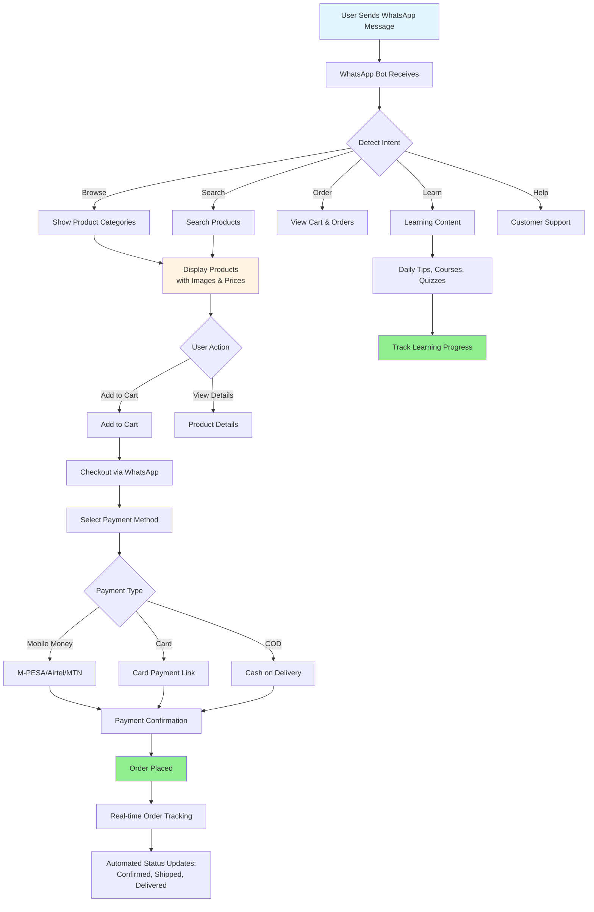

**WhatsApp Features:**

| Feature | Capabilities |
|---------|-------------|
| **Product Discovery** | Browse categories, search products, view images/prices, product recommendations |
| **Shopping Cart** | Add/remove items, view cart, modify quantities, save for later |
| **Checkout** | Complete purchase flow, address entry, payment selection, order confirmation |
| **Order Tracking** | Real-time status updates, delivery notifications, proof of delivery |
| **Customer Support** | 24/7 chatbot, human agent escalation, order inquiries, complaint resolution |

| **Account Management** | Profile updates, order history, saved addresses, payment methods |
| **Notifications** | Order updates, payment confirmations, promotional offers, learning reminders |
| **Language Support** | English, Swahili (expandable to local languages) |
| **Offline Capability** | Queue messages when offline, sync when connected |

**WhatsApp Technical Implementation:**

| Component | Technology |
|-----------|------------|
| API | WhatsApp Business Cloud API (Meta) |
| Bot Framework | Custom NLP engine with intent recognition |
| Message Queue | Redis for message processing |
| Media Handling | Cloudinary for image optimization |
| Session Management | Redis-based conversation state |
| Analytics | Message engagement, conversion tracking |
| Compliance | Opt-in management, GDPR/data protection |

### 1.5 Technology Stack

| Layer | Technologies |
|-------|-------------|
| **Frontend** | React 18, Next.js 14, TailwindCSS, PWA |
| **Backend** | NestJS, GraphQL, REST APIs |
| **Database** | PostgreSQL 15, Redis 7, Elasticsearch 8 |
| **Storage** | AWS S3, Cloudinary (images/videos) |
| **Messaging** | WhatsApp Business API, Twilio (SMS), SendGrid (Email) |
| **Payments** | Flutterwave, Paystack, M-PESA API |
| **Infrastructure** | AWS (EC2, RDS, S3, CloudFront), Docker, Kubernetes |
| **CI/CD** | GitHub Actions, Docker, Terraform |
| **Monitoring** | Datadog, Sentry, CloudWatch |
| **Security** | SSL/TLS, OAuth 2.0, JWT, AES-256 encryption |

### 1.6 White-Label Capabilities

Jirani is built from the ground up to support multiple Partner Financial Institutions (PFIs) with complete branding customization:

| Customization | Options |
|---------------|---------|
| **Branding** | Custom logo, color scheme, typography, favicon |
| **Domain** | Custom domain (e.g., marketplace.pfiname.com) or subdomain |
| **WhatsApp** | Custom sender names, branded messages |
| **User Interface** | Customizable homepage, navigation, footer |
| **Payment Methods** | PFI-specific payment gateway configurations |
| **Content** | Custom landing pages, help center, FAQs |
| **Features** | Enable/disable features per PFI requirements |
| **Integrations** | PFI-specific API integrations (core banking, CRM) |
| **Reporting** | Custom dashboards and analytics per PFI |

### 1.7 Scalability & Multi-Tenancy

**Multi-Tenancy Architecture:**
- Shared infrastructure with isolated data per PFI
- Row-level security (RLS) for data protection
- Tenant-aware caching and session management
- Independent scaling per tenant
- Automated tenant provisioning (< 1 hour)

### 1.8 Compliance & Security

| Aspect | Implementation |
|--------|----------------|
| **Data Protection** | GDPR compliant, data encryption at rest and in transit |
| **Payment Security** | PCI-DSS Level 1 compliant |
| **Authentication** | Multi-factor authentication (MFA), OAuth 2.0, JWT |
| **Authorization** | Role-based access control (RBAC), granular permissions |
| **Audit Trail** | Immutable logs for all transactions and changes |
| **Backup** | Automated daily backups, 30-day retention, point-in-time recovery |
| **Disaster Recovery** | Multi-region deployment, RTO <4 hours, RPO <1 hour |
| **Penetration Testing** | Quarterly security audits, vulnerability scanning |
| **Compliance** | KYC/AML integration, financial regulations by country |

---

## 2. System Architecture Overview

### 1.1 High-Level Architecture

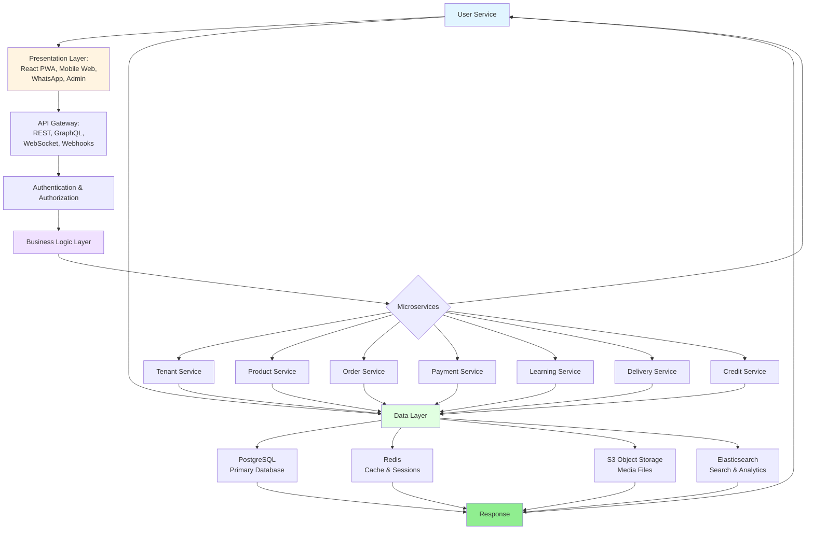

### 1.2 Multi-Tenancy Strategy

**Hybrid Approach:**
- Shared database with isolated schemas per PFI
- Row-Level Security (RLS) for data protection
- Tenant context propagation throughout request lifecycle
- Dynamic white-label theming per PFI

**Tenant Onboarding Flow:**

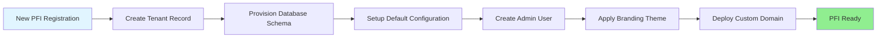

---

## 2. Technology Stack

### 2.1 Frontend

**Frontend Architecture & Interactions:**

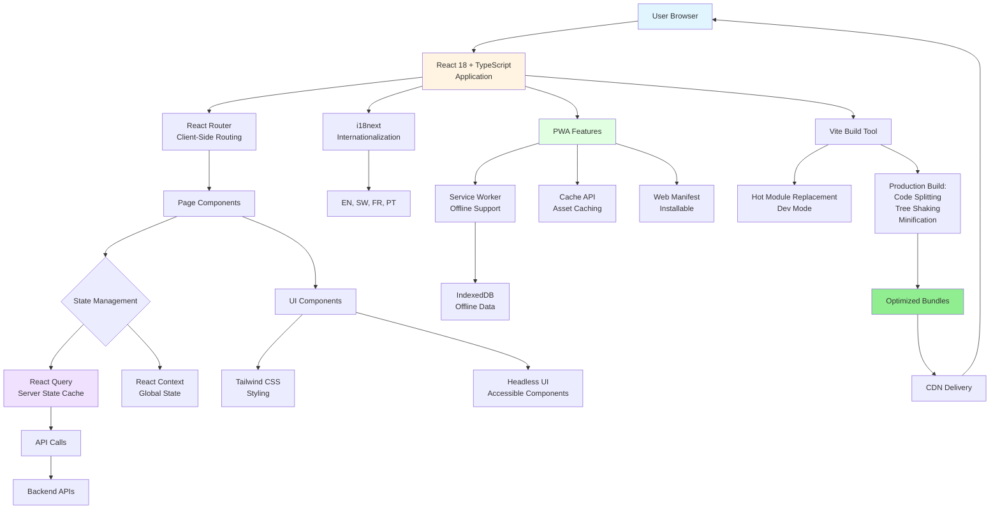

| Component | Technology | Justification |
|-----------|-----------|---------------|
| Framework | React 18 + TypeScript | Industry standard, type safety |
| Build Tool | Vite | Fast builds, optimized output |
| UI Library | Tailwind CSS + Headless UI | Customizable, accessible |
| State | React Query + Context | Server caching, optimistic updates |
| Mobile | Progressive Web App (PWA) | Offline support, installable |
| i18n | i18next | English, Swahili, French, Portuguese |

### 2.2 Backend

**Backend Architecture & Interactions:**

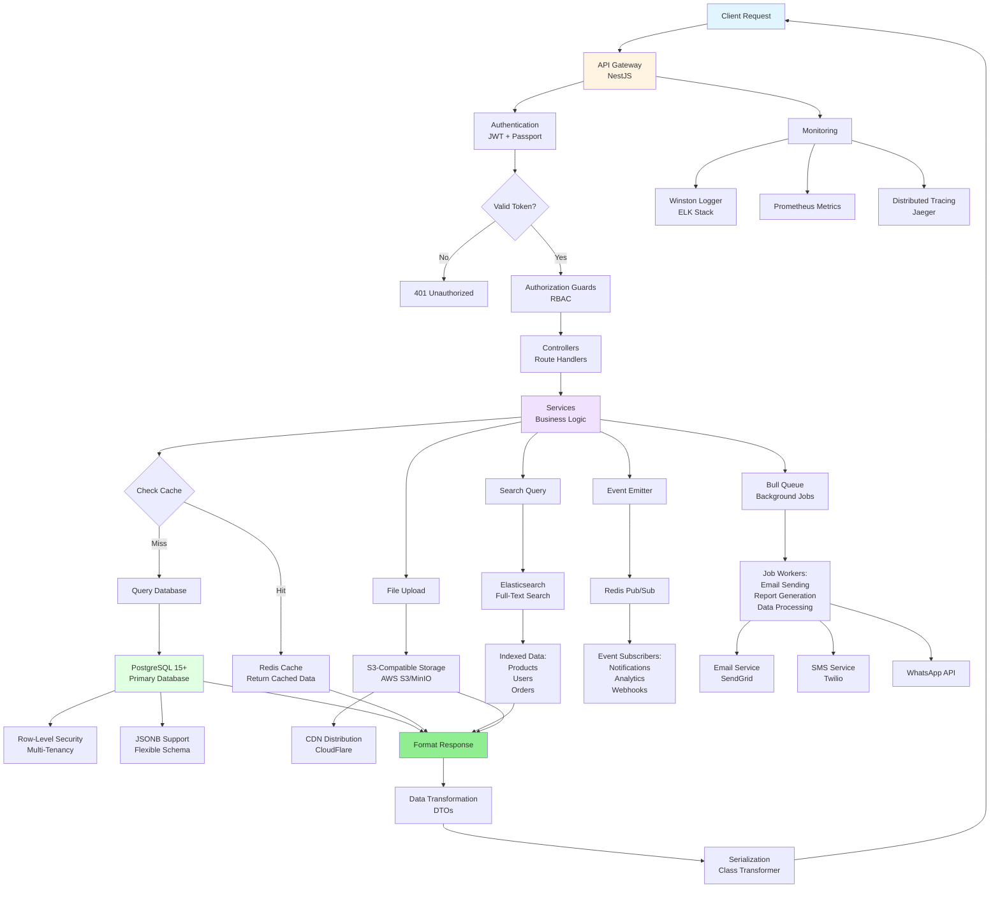

| Component | Technology | Justification |
|-----------|-----------|---------------|
| Runtime | Node.js 20 LTS | Mature, performant |
| Framework | NestJS | Enterprise-grade, modular |
| Database | PostgreSQL 15+ | ACID, JSON support, multi-tenancy |
| Cache | Redis 7+ | In-memory speed, pub/sub |
| Search | Elasticsearch | Full-text search, analytics |
| Storage | S3-compatible | Scalable, CDN integration |
| Queue | Bull (Redis) | Job processing, retry logic |

### 2.3 Infrastructure

**Infrastructure Flow:**

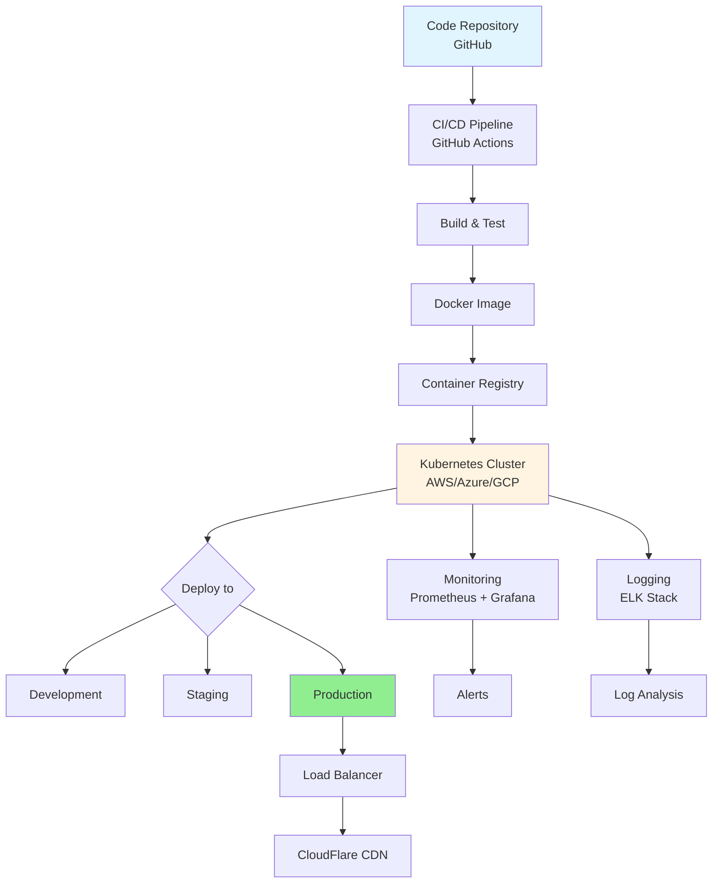

| Component | Technology |
|-----------|------------|
| Cloud | AWS / Azure / GCP |
| Container | Docker |
| Orchestration | Kubernetes |
| CI/CD | GitHub Actions |
| Monitoring | Prometheus + Grafana |
| Logging | ELK Stack |
| CDN | CloudFlare |

### 2.4 Integrations

**Integration Architecture:**

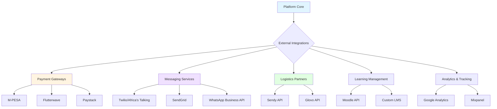

| Component | Technology |
|-----------|------------|
| Payments | M-PESA, Flutterwave, Paystack |
| Messaging | Twilio, SendGrid, Africa's Talking |
| WhatsApp | WhatsApp Business API |
| LMS | Moodle API / Custom |
| Logistics | Sendy, Glovo APIs |

---

## 3. Core Platform Features

### 3.1 Home/Landing Page

**Landing Page Flow:**

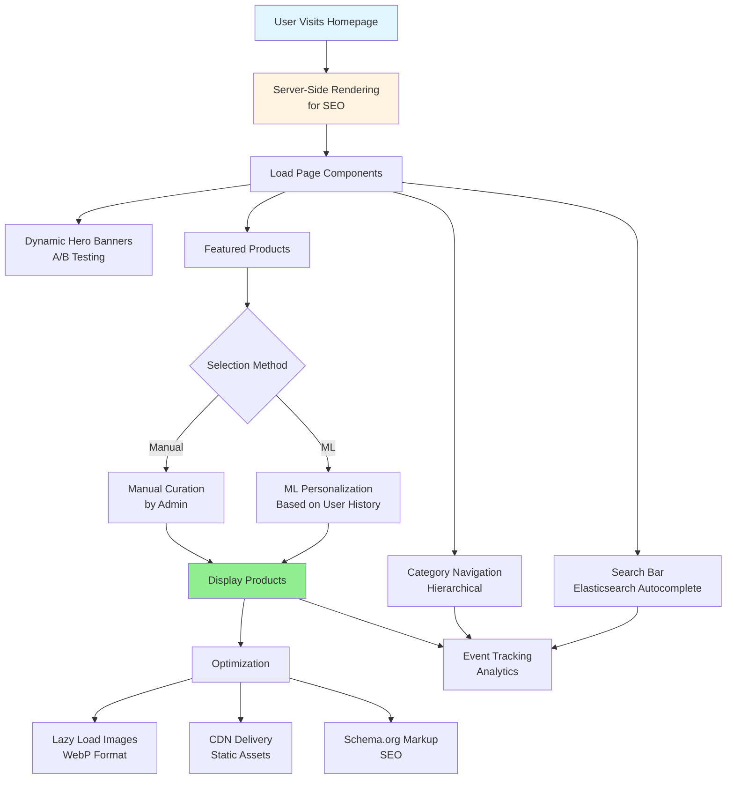

**Architecture Components:**
- Dynamic hero banners with A/B testing
- Elasticsearch-powered search with autocomplete
- Hierarchical category navigation
- Featured products (algorithm + manual curation)
- ML-based personalization engine

**Technical Implementation:**
- Server-side rendering (SSR) for SEO
- Lazy loading for images (WebP format)
- CDN delivery for static assets
- Event tracking for analytics
- Structured data (Schema.org)

### 3.2 User Dashboard (Buyers)

**Key Features:**
- Recent activity feed
- Order tracking with real-time updates
- Wishlist with price alerts
- Notification center (in-app, email, SMS, WhatsApp)
- Profile and address management
- Support ticket system

**Technical Implementation:**

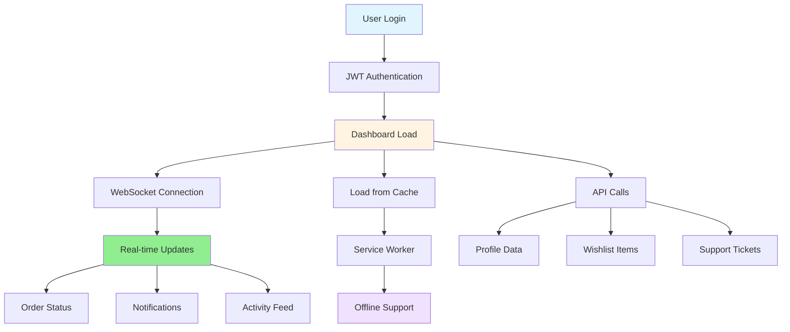

**Implementation Details:**
- WebSocket for real-time updates
- Service workers for offline support
- Optimistic UI updates
- JWT authentication with refresh tokens
- Mobile-first responsive design

### 3.3 Seller/Vendor Dashboard

**Product Management:**
- Bulk upload (CSV, Excel)
- Multi-image upload
- Product variants
- Inventory tracking
- Low-stock alerts

**Order Fulfillment:**
- Order queue with priority
- Bulk processing
- Shipping label generation
- Return/refund management

**Analytics:**
- Revenue trends
- Best-selling products
- Conversion rates
- Customer metrics
- Profit analysis

**Technical Implementation:**

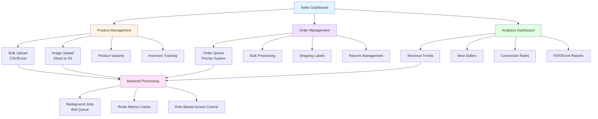

**Implementation Details:**
- Background job processing
- Pre-aggregated metrics (Redis)
- Direct-to-S3 uploads
- PDF/Excel report generation
- Role-based access control

### 3.4 Product Detail Pages

**Features:**
- Rich media gallery (images, videos, 360°)
- Detailed descriptions with rich text
- Dynamic pricing and promotions
- Real-time stock status
- Seller profile and ratings
- Reviews with images
- Q&A section
- AI-powered recommendations
- Social sharing

**Technical Implementation:**

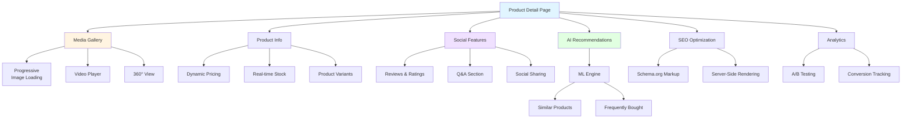

**Implementation Details:**
- Progressive image loading
- SEO optimization (structured data)
- Code splitting
- A/B testing framework
- Conversion tracking

### 3.5 Cart & Checkout

**Shopping Cart:**
- Persistent cart (logged in)
- Guest cart with sessions
- Cross-device sync
- Promo code support
- Save for later

**Checkout Flow:**

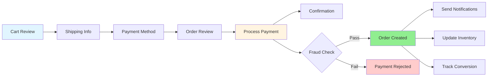

**Technical Implementation:**

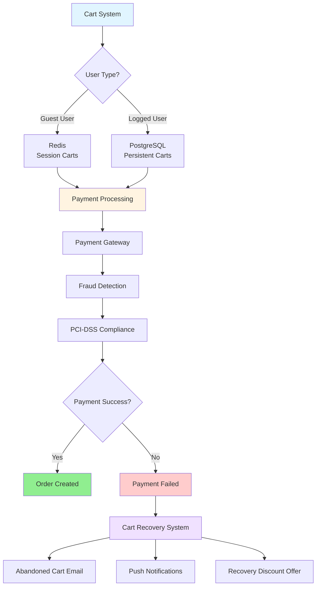

**Implementation Details:**
- Redis for session carts
- PostgreSQL for user carts
- Multi-step form validation
- PCI-DSS compliant payments
- Fraud detection
- Abandoned cart recovery

### 3.6 Admin Panel

**Admin Access Flow:**

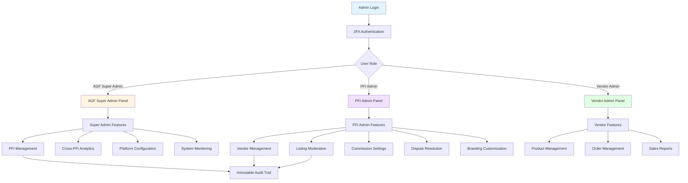

**AGF Super Admin:**
- PFI management
- Cross-PFI analytics
- Platform configuration
- Content management
- System monitoring
- Audit logs

**PFI Admin:**
- Vendor management
- Listing moderation
- Commission settings
- Dispute resolution
- PFI-specific analytics
- Support tools
- Branding customization

**Technical Implementation:**
- Role-based access control (RBAC)
- Immutable audit trail
- Bulk operations
- Real-time dashboards
- 2FA and IP whitelisting

### 3.7 Analytics & Reporting

**Analytics Pipeline:**

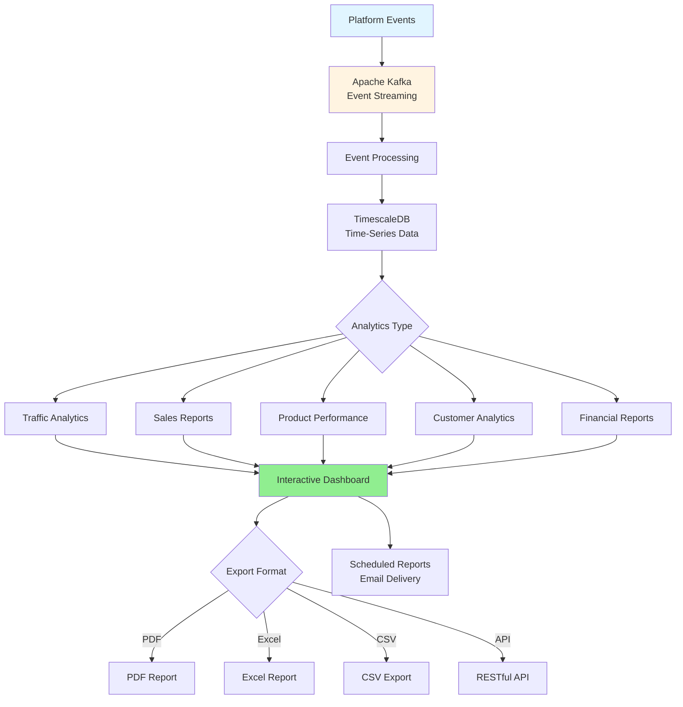

**Report Types:**
- Traffic analytics
- Sales reports
- Product performance
- Customer analytics
- Financial reports

**Technical Implementation:**
- Apache Kafka for event streaming
- TimescaleDB for time-series data
- Interactive visualizations
- Scheduled reports
- Export to PDF/Excel/CSV
- RESTful API access

### 3.8 Notifications & Messaging

**Notification Flow:**

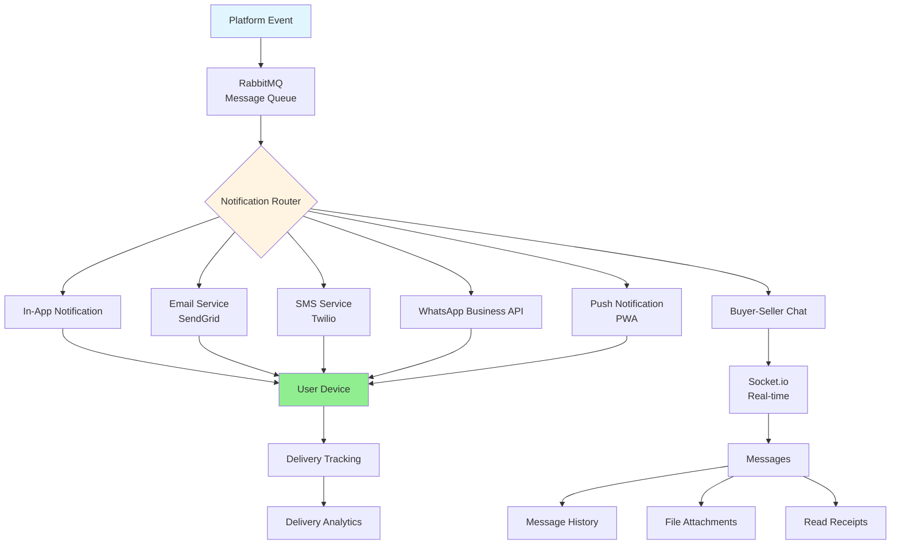

**Channels:**
- In-app notifications
- Email (transactional + marketing)
- SMS (critical alerts)
- WhatsApp (order updates)
- Push notifications (PWA)

**Buyer-Seller Chat:**
- Real-time messaging
- File attachments
- Message history
- Read receipts
- Chatbot support

**Technical Implementation:**
- RabbitMQ message queue
- Template engine (Handlebars)
- Socket.io for real-time chat
- Retry logic with exponential backoff
- Delivery analytics

### 3.9 Authentication & User Management

**Authentication Flow:**

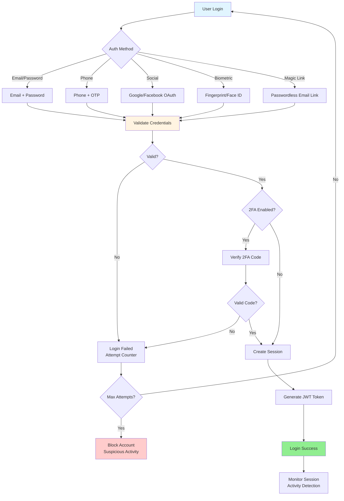

**Authentication Methods:**
- Email/password
- Phone + OTP
- Social login (Google, Facebook)
- Biometric (fingerprint, face ID)
- Magic link (passwordless)

**Security Features:**
- Password strength requirements
- Two-factor authentication (2FA)
- Session management
- Login attempt limiting
- Suspicious activity detection

**KYC/Verification:**
- Document upload
- Automated verification (OCR)
- Manual review workflow
- Re-verification triggers

**Technical Implementation:**
- JWT with refresh tokens
- Bcrypt password hashing
- OAuth 2.0 for social login
- Redis session store
- Third-party KYC services
- Rate limiting and CAPTCHA

### 3.10 Content & Community

**Features:**
- Blog/articles
- Discussion forums
- Guides/tutorials
- FAQ section
- User profiles
- Badges and achievements

**Technical Implementation:**
- Headless CMS (Strapi)
- Forum engine (custom/Discourse)
- Full-text search
- Content moderation tools
- User reputation system

---

*Continued in Part 2...*
