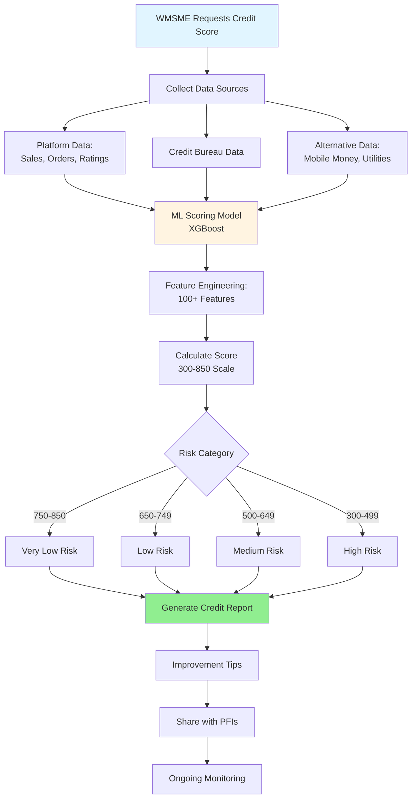
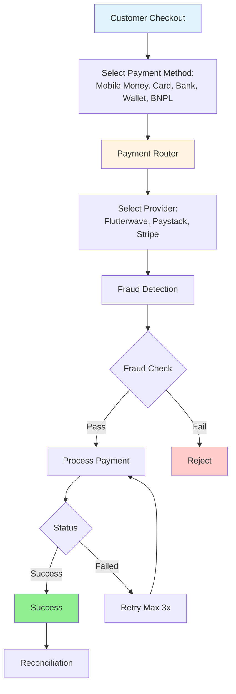
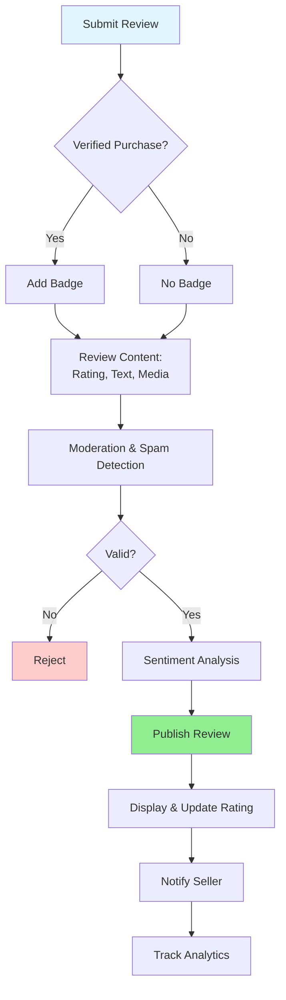
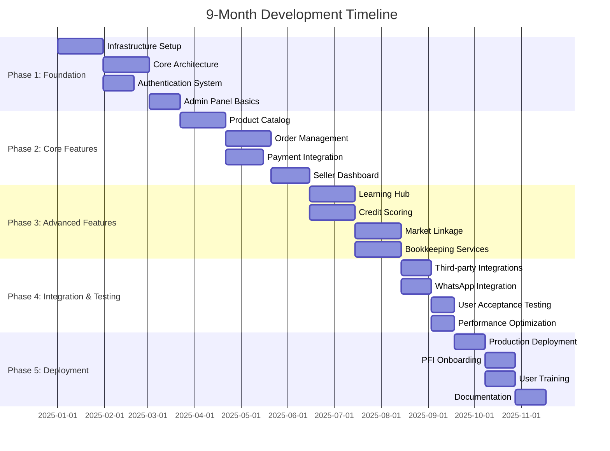
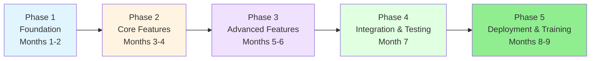
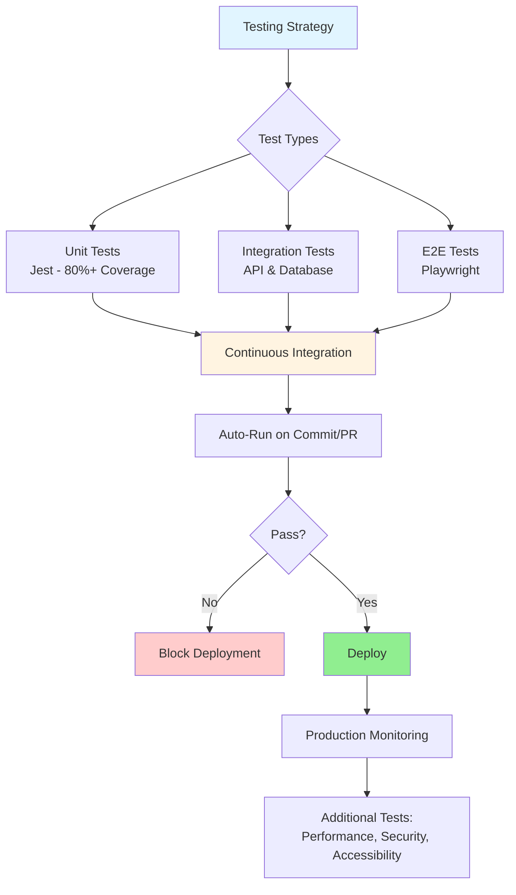
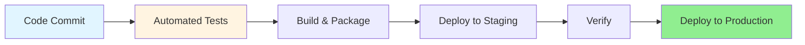
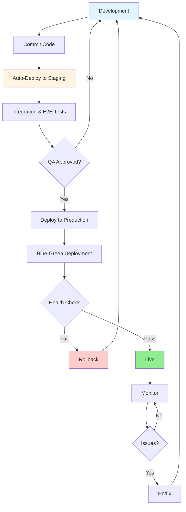

# Technical Proposal Part 3: Credit Scoring, Payments & Implementation

## 5. Financial & Payment Features

### 5.1 Credit Scoring / Funding Ready

**Objective:** Assess WMSME creditworthiness using transaction data and alternative metrics.

**Credit Scoring Flow:**



**Key Features:**

1. **Data Collection**
   - Transaction history (sales, purchases)
   - Payment behavior (on-time, late, defaults)
   - Business metrics (revenue, growth rate)
   - Inventory turnover
   - Customer reviews and ratings
   - Platform engagement
   - Mobile money transactions
   - Utility payment history

2. **Scoring Algorithm**
   - **Transaction Analysis** (35%)
     - Sales volume and consistency
     - Revenue growth trends
     - Seasonal patterns
   
   - **Payment Behavior** (30%)
     - Payment punctuality
     - Outstanding debts
     - Credit utilization
   
   - **Business Health** (20%)
     - Profit margins
     - Inventory management
     - Customer retention
   
   - **Alternative Data** (15%)
     - Social media presence
     - Customer reviews
     - Platform activity
     - Mobile money usage

3. **Credit Score Components**
   - Numerical score (300-850 scale)
   - Score breakdown by category
   - Comparison to industry average
   - Score trend over time
   - Risk category (low, medium, high)

4. **Credit Report**
   - Comprehensive PDF report
   - Score explanation
   - Strengths and weaknesses
   - Improvement recommendations
   - Eligible financial products
   - Downloadable and shareable

5. **Improvement Tips**
   - Actionable recommendations
   - Progress tracking
   - Milestone achievements
   - Educational resources
   - Alerts for score changes

6. **Lender Integration**
   - Share score with PFIs
   - Pre-qualification for loans
   - Application fast-track
   - Consent management

**Technical Implementation:**

- **Machine Learning**: Gradient boosting model (XGBoost/LightGBM)
- **Feature Engineering**: 100+ features from transaction data
- **Training Data**: Historical loan performance data
- **Model Updates**: Quarterly retraining with new data
- **Explainability**: SHAP values for score interpretation
- **Alternative Data**: APIs for mobile money, utilities
- **Credit Bureau**: Integration with local credit bureaus
- **Security**: Encrypted storage, access controls
- **Compliance**: Fair lending practices, data privacy
- **API**: RESTful API for PFI integration

---

### 5.2 Payment Gateway Integration

**Objective:** Enable secure, multi-channel payment acceptance.

**Payment Processing Flow:**



**Key Features:**

1. **Payment Methods**
   - **Mobile Money**: M-PESA, Airtel Money, MTN Mobile Money, Orange Money
   - **Cards**: Visa, Mastercard, American Express
   - **Bank Transfer**: Direct bank transfers, EFT
   - **Digital Wallets**: PayPal, Skrill
   - **Buy Now Pay Later**: Installment payment options
   - **Cash on Delivery**: For specific regions

2. **Multi-Currency Support**
   - Local currencies (KES, UGX, TZS, NGN, GHS, etc.)
   - International currencies (USD, EUR, GBP)
   - Real-time exchange rates
   - Currency conversion at checkout
   - Multi-currency wallets

3. **Payment Features**
   - One-click payments (saved methods)
   - Split payments (multiple methods)
   - Recurring payments (subscriptions)
   - Partial payments
   - Payment links (share via WhatsApp, SMS)
   - QR code payments

4. **Security**
   - PCI-DSS Level 1 compliance
   - 3D Secure authentication
   - Tokenization (no card storage)
   - Encryption (TLS 1.3)
   - Fraud detection and prevention
   - Risk scoring

5. **Transaction Management**
   - Real-time status updates
   - Automatic retries for failed payments
   - Refund processing
   - Chargeback handling
   - Transaction receipts (email, SMS)
   - Invoice generation

6. **Reporting**
   - Transaction history
   - Settlement reports
   - Fee breakdowns
   - Reconciliation reports
   - Export to accounting software

**Technical Implementation:**

- **Payment Gateway SDKs**: Flutterwave, Paystack, Stripe
- **Payment Orchestration**: Custom routing logic for optimal success rates
- **Webhook Handling**: Secure webhook verification and processing
- **Retry Mechanism**: Exponential backoff for failed transactions
- **Fraud Detection**: Machine learning model for risk scoring
- **Reconciliation**: Automated daily reconciliation
- **Compliance**: PCI-DSS, PSD2, local regulations
- **Monitoring**: Real-time alerts for payment failures
- **Fallback**: Multiple provider support for redundancy

---

### 5.3 Ratings & Reviews

**Objective:** Build trust through transparent feedback systems.

**Review Management Flow:**



**Key Features:**

1. **Review Submission**
   - Star ratings (1-5 stars)
   - Written reviews (text)
   - Photo/video uploads
   - Verified purchase badge
   - Anonymous option
   - Review categories (quality, delivery, service)

2. **Review Display**
   - Average rating with star visualization
   - Rating distribution (5-star breakdown)
   - Most helpful reviews
   - Recent reviews
   - Verified purchase filter
   - Sort options (recent, helpful, rating)

3. **Seller Response**
   - Reply to reviews
   - Thank customers
   - Address concerns
   - Response time tracking
   - Response rate display

4. **Moderation**
   - Automated spam detection
   - Profanity filtering
   - Manual review queue
   - Report inappropriate reviews
   - Review guidelines enforcement

5. **Review Incentives**
   - Points/rewards for reviews
   - Review reminders (post-purchase)
   - Featured reviewer badges
   - Review contests

6. **Analytics**
   - Average rating trends
   - Sentiment analysis
   - Common themes/keywords
   - Review impact on sales
   - Response effectiveness

**Technical Implementation:**

- **Verification**: Link reviews to verified purchases
- **Spam Detection**: ML model for spam/fake reviews
- **Sentiment Analysis**: NLP for positive/negative sentiment
- **Image Moderation**: AI-powered inappropriate content detection
- **Aggregation**: Real-time rating calculations
- **Caching**: Redis for frequently accessed ratings
- **Notifications**: Alert sellers of new reviews
- **SEO**: Structured data for rich snippets

---

## 6. Security & Compliance

### 6.1 Security Architecture

**Multi-Layer Security Approach:**

```
┌─────────────────────────────────────────────────────────────┐
│                    Security Layers                           │
├──────────┬──────────┬──────────┬──────────┬────────────────┤
│ Network  │ Applica  │ Data     │ Identity │ Monitoring     │
│ Security │ tion     │ Security │ & Access │                │
└──────────┴──────────┴──────────┴──────────┴────────────────┘
```

**Key Security Features:**

1. **Network Security**
   - DDoS protection (CloudFlare)
   - Web Application Firewall (WAF)
   - Rate limiting
   - IP whitelisting for admin access
   - VPN for internal systems

2. **Application Security**
   - Input validation and sanitization
   - SQL injection prevention
   - XSS protection
   - CSRF tokens
   - Secure headers (CSP, HSTS)
   - Dependency scanning

3. **Data Security**
   - Encryption at rest (AES-256)
   - Encryption in transit (TLS 1.3)
   - Database encryption
   - Secure key management (AWS KMS)
   - Data masking for PII
   - Secure backups

4. **Identity & Access**
   - Multi-factor authentication (2FA)
   - Role-based access control (RBAC)
   - Password policies
   - Session management
   - OAuth 2.0 / OpenID Connect
   - Biometric authentication

5. **Monitoring & Incident Response**
   - Security Information and Event Management (SIEM)
   - Intrusion detection system (IDS)
   - Log aggregation and analysis
   - Automated alerts
   - Incident response plan
   - Regular security audits

### 6.2 Compliance Framework

**Regulatory Compliance:**

1. **Data Protection**
   - GDPR compliance (EU users)
   - Data Protection Act (local regulations)
   - Privacy policy and terms of service
   - Cookie consent management
   - Right to be forgotten
   - Data portability

2. **Financial Compliance**
   - PCI-DSS Level 1 (payment card data)
   - KYC (Know Your Customer)
   - AML (Anti-Money Laundering)
   - Transaction monitoring
   - Suspicious activity reporting

3. **Accessibility**
   - WCAG 2.1 Level AA compliance
   - Screen reader support
   - Keyboard navigation
   - Color contrast
   - Alternative text for images

4. **Industry Standards**
   - ISO 27001 (Information Security)
   - SOC 2 Type II
   - Regular penetration testing
   - Vulnerability assessments
   - Security certifications

---

## 7. Implementation Methodology

### 7.1 Development Approach

**Agile Methodology with Scrum Framework:**

- **Sprint Duration**: 2 weeks
- **Team Structure**: Cross-functional teams
- **Ceremonies**: Daily standups, sprint planning, retrospectives
- **Tools**: Jira, Confluence, GitHub

**Development Phases:**



**Phase Breakdown:**



### 7.2 Quality Assurance

**Testing Strategy:**



**Testing Layers:**

1. **Unit Testing**
   - Code coverage: 80%+
   - Jest for JavaScript/TypeScript
   - Automated test execution
   - Fast feedback loop

2. **Integration Testing**
   - API endpoint testing
   - Database integration
   - Third-party service mocks
   - Contract testing

3. **End-to-End Testing**
   - Playwright for UI testing
   - Critical user flows
   - Cross-browser testing
   - Mobile responsiveness

4. **Performance Testing**
   - Load testing (Apache JMeter)
   - Stress testing
   - Scalability testing
   - Response time benchmarks
   - Database query optimization

5. **Security Testing**
   - Penetration testing
   - Vulnerability scanning (OWASP ZAP)
   - Code security analysis (SonarQube)
   - Compliance audits
   - Dependency vulnerability checks

6. **User Acceptance Testing**
   - Beta testing with WMSMEs
   - Feedback collection
   - Usability testing
   - Accessibility testing (WCAG 2.1)

### 7.3 Deployment Strategy

**Continuous Integration/Continuous Deployment (CI/CD):**



**Deployment Pipeline:**
- **Code Commit**: Developer pushes code to Git
- **Automated Tests**: Run unit, integration, E2E tests
- **Build**: Docker image creation, dependency installation
- **Staging Deployment**: Deploy to staging environment
- **Smoke Tests**: Verify critical functionality
- **Production Deployment**: Blue-green deployment
- **Health Checks**: Monitor application health
- **Rollback**: Automatic rollback on failure

**Environment Strategy:**



**Deployment Approach:**
- **Blue-green deployment** for zero downtime
- **Feature flags** for gradual rollout
- **Automated rollback** on failures
- **Database migration strategy** with backward compatibility
- **Canary releases** for high-risk changes
- **Health checks** at every stage

---

## 8. Project Timeline & Deliverables

### 8.1 Detailed Timeline (9 Months)

**Month 1-2: Foundation & Setup**
- Infrastructure provisioning
- Development environment setup
- Core architecture implementation
- Authentication & authorization
- Admin panel foundation
- **Deliverable**: Infrastructure setup document, basic admin panel

**Month 3-4: Core Marketplace Features**
- Product catalog management
- Shopping cart & checkout
- Order management system
- Payment gateway integration
- Seller dashboard
- Buyer dashboard
- **Deliverable**: Functional marketplace MVP

**Month 5-6: Advanced Features**
- Learning hub & LMS
- WhatsApp microlearning
- Credit scoring system
- Market linkage platform
- Bookkeeping services
- Events management
- **Deliverable**: Complete feature set

**Month 7: Integration & Testing**
- Third-party API integrations
- Logistics integration
- WhatsApp Business API
- Comprehensive testing
- Performance optimization
- Security audits
- **Deliverable**: Tested and optimized platform

**Month 8: Deployment & Training**
- Production deployment
- PFI onboarding
- WMSME onboarding
- Training sessions
- Documentation
- **Deliverable**: Live platform, trained users

**Month 9: Stabilization & Handover**
- Bug fixes and refinements
- Performance monitoring
- User feedback incorporation
- Final documentation
- Knowledge transfer
- **Deliverable**: Stable platform, complete documentation

### 8.2 Key Deliverables

1. **Technical Deliverables**
   - Source code (GitHub repository)
   - Database schema and migrations
   - API documentation (Swagger/OpenAPI)
   - Architecture documentation
   - Deployment scripts
   - Infrastructure as Code (Terraform)

2. **User Documentation**
   - User manuals (buyers, sellers, admins)
   - Video tutorials
   - FAQ documentation
   - Troubleshooting guides
   - API integration guides

3. **Training Materials**
   - Training presentations
   - Hands-on workshop materials
   - Quick reference guides
   - Best practices documentation

4. **Reports**
   - Testing reports
   - Security audit reports
   - Performance benchmarks
   - User acceptance testing results
   - Final project report

---

## 9. Team Composition

### 9.1 Core Team Structure

**Project Management (2)**
- Project Manager
- Scrum Master

**Design Team (3)**
- UI/UX Lead Designer
- UI/UX Designer
- Graphic Designer

**Frontend Development (4)**
- Frontend Lead Developer
- Senior Frontend Developers (2)
- Frontend Developer

**Backend Development (5)**
- Backend Lead Developer
- Senior Backend Developers (2)
- Backend Developers (2)

**Mobile Development (2)**
- Mobile Lead Developer
- Mobile Developer

**DevOps & Infrastructure (2)**
- DevOps Lead
- DevOps Engineer

**Quality Assurance (3)**
- QA Lead
- QA Engineers (2)

**Data & Analytics (2)**
- Data Engineer
- ML Engineer

**Security (1)**
- Security Specialist

**Content & Training (2)**
- Content Creator
- Training Specialist

**Total Team Size: 26 professionals**

### 9.2 Team Qualifications

- **Average Experience**: 5+ years in respective domains
- **Certifications**: AWS/Azure certified, Scrum certified
- **African Market Experience**: Team members with local market knowledge
- **Language Skills**: English, Swahili, French proficiency

---

## 10. Maintenance & Support

### 10.1 Support Model

**Three-Tier Support Structure:**

**Tier 1: Help Desk**
- Email and chat support
- Basic troubleshooting
- Ticket creation
- Response time: 2 hours

**Tier 2: Technical Support**
- Complex technical issues
- Bug investigation
- Configuration assistance
- Response time: 4 hours

**Tier 3: Engineering Support**
- Critical system issues
- Code-level debugging
- Architecture consultation
- Response time: 1 hour (critical), 8 hours (normal)

### 10.2 Maintenance Plan

**Regular Maintenance:**
- Weekly security patches
- Monthly feature updates
- Quarterly major releases
- Annual infrastructure upgrades

**Monitoring & Alerting:**
- 24/7 system monitoring
- Automated alerts for critical issues
- Performance dashboards
- Uptime SLA: 99.9%

**Backup & Disaster Recovery:**
- Daily automated backups
- Point-in-time recovery
- Geo-redundant storage
- Recovery Time Objective (RTO): 4 hours
- Recovery Point Objective (RPO): 1 hour

### 10.3 Long-Term Sustainability

**Knowledge Transfer:**
- Comprehensive documentation
- Code walkthroughs
- Architecture sessions
- Admin training

**Scalability Roadmap:**
- Horizontal scaling capabilities
- Database sharding strategy
- Microservices migration path
- Multi-region deployment

**Continuous Improvement:**
- User feedback loops
- Feature request management
- Performance optimization
- Technology upgrades

---

## Conclusion

This technical proposal outlines a comprehensive, scalable, and secure white-label digital marketplace platform designed specifically for WMSMEs in Africa. Our solution combines modern technology, mobile-first design, and deep understanding of African market needs to deliver a platform that will empower thousands of women-led businesses.

**Key Differentiators:**
- ✅ Mobile-first architecture optimized for low-bandwidth
- ✅ Comprehensive feature set covering all RFP requirements
- ✅ Proven technology stack with African market experience
- ✅ Strong security and compliance framework
- ✅ Experienced team with local market knowledge
- ✅ Clear implementation methodology and timeline
- ✅ Sustainable long-term support model

We are committed to delivering a platform that not only meets but exceeds AGF's expectations, creating lasting impact for WMSMEs across Africa.

---

**Contact Information:**
[Your Company Name]
[Contact Details]
[Email]
[Phone]
